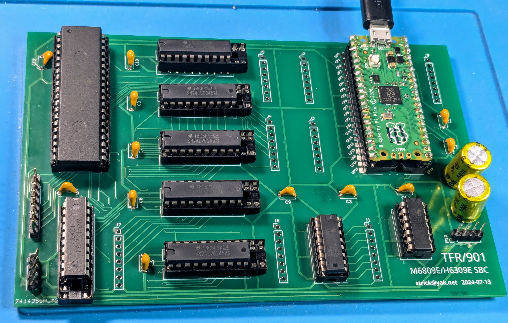
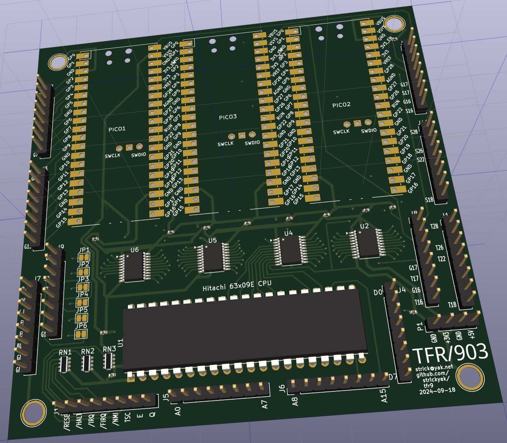
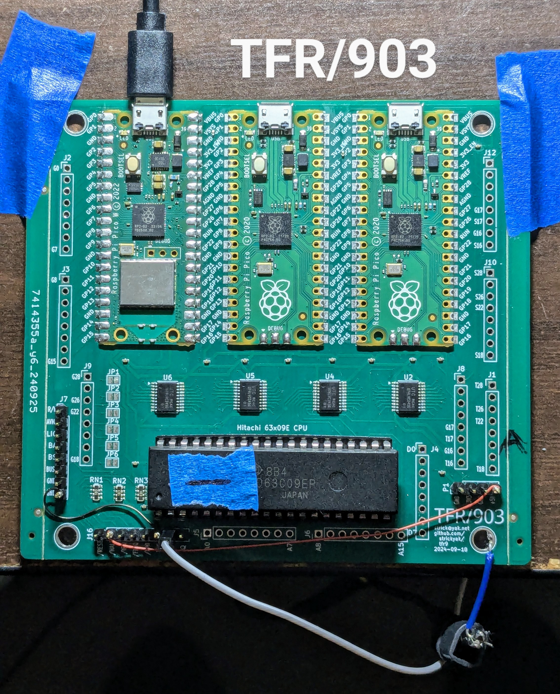
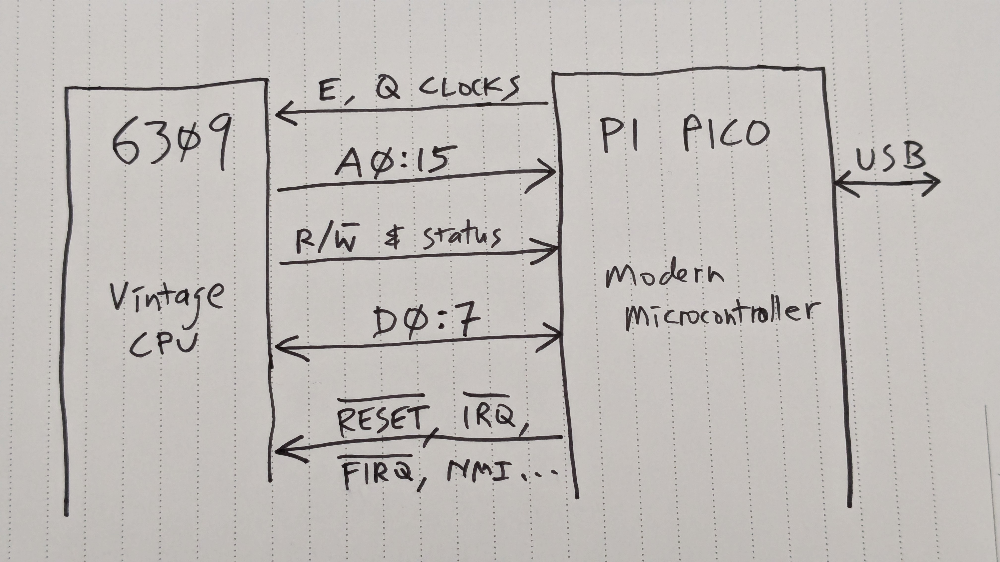

# The TFR/9: 6309 single board computers.

https://github.com/strickyak/tfr9/

Henry Strickland (github: strickyak; discord: strick9)

`TFR/9` is the name of the family of designs.

`TFR/901` and `TFR/903` have been produced.

More will come, making improvements.

## My corner of "Modern Retro"

"There's no wrong way to retro." -- Stevie Strow

* Genuine 8-bit CPU.

* Modern everything else, with lots of fakery.
Using another PC for keyboard, screen, disk, and network is OK.

* Really Cheap ($25? $15?).

* Runs a NitrOS-9 (both levels) and some Radio Shack Basic.

## First PCB: TFR/901



## Second PCB: TFR/903 (kicad's conception)



## Second PCB: TFR/903 (actual, bodged)



## Parts

1. `HD63C09EP` (hereafter, 6309): A vintage 8-bit (circa 1982) 6309 CPU in a DIP-40 package.

2. `Raspbery Pi Pico` (hereafter, Pico):  A modern microcontroller with
special "programmable IO" capabilities.  Any version of the 40-pin DIP
package will do (Pico 1, Pico 2, Pico 1 W, ...).

3. 4x `74LVC245`: Bus multiplexers (and voltage-level adapters) 
for connecting the 6309 and the Pico.  (Next I should use 74LVC4245s.)

4. Printed Circuit Board.  Currently (TFR/903) it is 100x100mm 4-layer.  I want to make
a simpler, cheaper 2-layer one next (TFR/905).

## Groups of 6309 Pins



## Multiplexing the G0:15 Bus


## Read & Write Clock Cycles


## The USB Cable and the Console

The Pi Pico has a USB (micro) socket.  This can connect to any
modern computer (window, linux, mac, raspberry pi, pi zero).

A program "tconsole" runs on that modern computer, to be the
keyboard and display for the machine.   It's also the
disk drive.


## What about Wifi?

If you use the "W" version of the Pico, wifi can be available.

This is the case on my current TFR/903, but I haven't
used it yet.

Note that at VCF in Mountain View last year, we were unable to
get a Pi Pico W on the network.  Maybe the little chip's signal
is too weak to participate in a noisy RF environment, or it
cannot handle connecting to one network out of lots and lots
of wifi networks.   We're not sure.

If you have a laptop with wifi, using the USB cable to the
Laptop might be the way to go.

But if we can get Wifi working, and you can add a keyboard
(USB on-the-go), VGA screen (using the second on-board Pico)
(or an HDMI screen if the second pico is a Pico 2),
and a way to provide power (there are optional headers you
can add, or use the USB connector) -- then you have a
portable 6309 computer!


## Extra Credit

The TFR/903 actually has three Pico's:

1. Main control of the 6309.

2. Reserved for generating VGA graphics (not yet begun).

3. For sound or whatever.

To simplify the (future) TFR/905 and make it cheaper,
there will be only one Pico.

## Code for Reset

TEXTFILE:code/reset.code

## Emulating RAM (coco2)

TEXTFILE:code/smallram.code

## Emulating MMU + RAM (coco3)

TEXTFILE:code/bigram.code

## Programmable IO Code

TEXTFILE:code/pio.code

## Example OS9 Level 2 Transcript

TEXTFILE:code/transcript-level2.txt


## Examining OS9 system calls

( cd tmanager903 ; cp -vf with-os9 tmanager.cpp )

```
 2192  grep OS9_CALL tconsole/_2
 2193  grep OS9_CALL tconsole/_2 | grep Fork
 2194  grep OS9_CALL tconsole/_2 | grep All
 2195  grep OS9_CALL tconsole/_2 | grep Exit
 2196  grep OS9_R tconsole/_2
 2197  grep OS9_R tconsole/_2  | less
 2198  grep OS9_R tconsole/_2  | awk '{ print $8 }' | sort -u | wc
 2199  grep OS9_R tconsole/_2  | awk '{ print $8 }' | sort -u
```

```
$ grep OS9_CALL tconsole/_2 | grep Fork
"" === OS9_CALL _76_ "e09a_07ff":  $03 = F$Fork ( A=lang_and_type=01, X=$module_name_ptr=b5cf="SysGo", Y=size_of_param_area=0000, U=start_of_param_area=b5a0, ) #759443 ...... T0[0 3e 5 1 2 3 4 3f ]
"2:SysGo" === OS9_CALL _194_ "bb4c_00fb":  $03 = F$Fork ( A=lang_and_type=01, X=$module_name_ptr=ba45="Shell", Y=size_of_param_area=000b, U=start_of_param_area=ba53, ) #1078734 ...... T1[7 3e 3e 0 2 3 4 3f ]
"3:Shell" === OS9_CALL _260_ "a44b_02dd":  $03 = F$Fork ( A=lang_and_type=11, X=$module_name_ptr=9f0d="Shell", Y=size_of_param_area=0008, U=start_of_param_area=02f8, ) #1384453 ...... T1[5 3e 3e 3e 2 3 4 3f ]
"4:Shell" === OS9_CALL _467_ "a44b_02ef":  $03 = F$Fork ( A=lang_and_type=11, X=$module_name_ptr=0070="basic09", Y=size_of_param_area=0001, U=start_of_param_area=0077, ) #2217482 ...... T1[8 3e 3e 3e 2 3 4 3f ]
$
```

```
$ grep OS9_RETURN tconsole/_2 | grep Fork
"" === OS9_RETURN _76_ "e09a_07ff":  $03 = F$Fork ( A=lang_and_type=01, X=$module_name_ptr=b5cf="SysGo", Y=size_of_param_area=0000, U=start_of_param_area=b5a0, ) #759443 --> ( RA=new_process_number=02, ) #780477 T0[0 6 5 1 2 3 4 3f ]
"2:SysGo" === OS9_RETURN _194_ "bb4c_00fb":  $03 = F$Fork ( A=lang_and_type=01, X=$module_name_ptr=ba45="Shell", Y=size_of_param_area=000b, U=start_of_param_area=ba53, ) #1078760 --> ( RA=new_process_number=03, ) #1118711 T1[7 3e 3e 0 2 3 4 3f ]
"3:Shell" === OS9_RETURN _260_ "a44b_02dd":  $03 = F$Fork ( A=lang_and_type=11, X=$module_name_ptr=9f0d="Shell", Y=size_of_param_area=0008, U=start_of_param_area=02f8, ) #1383791 --> ( RA=new_process_number=04, ) #1423469 T1[5 3e 3e 3e 2 3 4 3f ]
"4:Shell" === OS9_RETURN _467_ "a44b_02ef":  $03 = F$Fork ( A=lang_and_type=11, X=$module_name_ptr=0070="basic09", Y=size_of_param_area=0001, U=start_of_param_area=0077, ) #2216990 --> ( RA=new_process_number=05, ) #2241301 T1[8 3e 3e 3e 2 3 4 3f ]
$
```

```
$ grep OS9_R tconsole/_2  | awk '{ print $8 }' | sort -u
F$All64
F$AllImg
F$AllPrc
F$AllTsk
F$AProc
F$Boot
F$BtMem
F$DelPrc
F$DelTsk
F$Find64
F$FModul
F$Fork
F$FreeHB
F$GPrDsc
F$GProcP
F$Icpt
F$ID
F$IRQ
F$LDABY
F$LDDDXY
F$Link
F$MapBlk
F$Mem
F$Move
F$NMLink
F$NMLoad
F$PrsNam
F$Ret64
F$SetImg
F$Sleep
F$SLink
F$SPrior
F$SRqMem
F$SRtMem
F$SSvc
F$STime
F$UnLink
F$UnLoad
F$VModul
I$Attach
I$ChgDir
I$Close
I$Detach
I$Dup
I$GetStt
I$Open
I$Read
I$ReadLn
I$Write
I$WritLn
UNKNOWN
$
```

## Tracing Machine Cycles -- the beginning of REL

( cd tmanager903 ; cp -vf with-tracking-all tmanager.cpp )

TEXTFILE:code/t1

&nbsp;

## Tracing Machine Cycles -- somewhere in the SHELL

&nbsp;

TEXTFILE:code/t2

&nbsp;

## Tracing Machine Cycles -- some IOMAN

&nbsp;

TEXTFILE:code/t3

&nbsp;

## FIN
