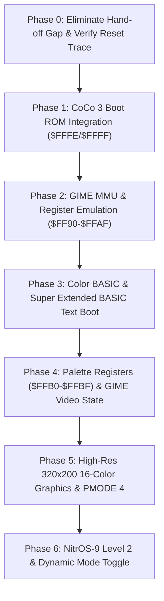

# CoCo 2 to CoCo 3 Transition Work Plan

## Overview & Goal
The objective is to enable a **Tandy Color Computer 2** equipped with the **Centipede RP2350B Cartridge** to functionally emulate a **Color Computer 3 (CoCo 3)**.

* **Hard Switch**: `#define BECOME_COCO3 1` allocates 128KB of physical RAM on the RP2350B.
* **Soft Switch**: `centipede_config.become_coco3` allows selecting between "CoCo 2 as CoCo 2" and "CoCo 2 as CoCo 3" at runtime (via Tcl menu, mode scripts, or holding `Z` on boot).
* **Architecture**: Centipede's `Engine3` inherits `DoCoco128k<Engine3>` and `CoreEngine<Engine3>`, providing cycle-accurate 6809 bus interception, MMU bank translation, and GIME I/O emulation.

---

## Technical Investigation: Eliminating the ~50 µs Spoonfeeding-to-Bus Gap

### 1. Root Cause Analysis
During analysis of cycle logging upon exiting the Tcl spoonfeeding console (`bye`), a gap of approximately **50 microseconds** (~45–50 bus cycles on the 0.89 MHz 6809) was observed before cycle logging begins.

Inspection of [`firmware/gspoon.h`](file:///home/strick/modoc/coco-shelf/tfr9/v4/centipede-32z/firmware/gspoon.h) and [`firmware/centipede.cpp`](file:///home/strick/modoc/coco-shelf/tfr9/v4/centipede-32z/firmware/centipede.cpp) reveals the exact mechanism:

1. **`Jump(0xA027)` Spoonfeeds JMP**:
   In `DriveConsole()`:
   ```cpp
   } else if (cmd == BG2FG_EXIT_CONSOLE) {
     Jump(0xA027);  // Spoonfeeds 0x7E 0xA0 0x27 to the 6809
     drive_console_ready = false;
     tcl_io::remove_coco2();
     cobs_printf("DriveConsole: bye, returning to normal foreground.\n");
     return;
   }
   ```
   At the end of `Jump(0xA027)`, the 6809 CPU has loaded its Program Counter with `$A027`. The very next cycle on the motherboard bus is the 6809 fetching the instruction opcode from `$A027`!
2. **Blocking USB Output on Core 1**:
   Instead of immediately servicing that read, Core 1 executes:
   * `drive_console_ready = false;`
   * `tcl_io::remove_coco2();`
   * `cobs_printf("DriveConsole: bye, returning to normal foreground.\n");`
     `cobs_printf` formats and transmits 53 bytes over USB CDC `putchar_raw`. Transmitting this string on Core 1 takes **~50 µs**!
3. **Delayed Bus Loop Entry**:
   While Core 1 is stalled doing USB serial output, the 6809 executes ~45 bus cycles. The PIO either stalls or drops cycles. Furthermore:
   * `DriveConsole()` unwinds back to `SpoonfeedConsoleOnReset()`.
   * `SpoonfeedConsoleOnReset()` returns to `foreground()`.
   * `PUSH_TO_BG(FG2BG_START_KEYBOARD_INJECTOR, 0, 0)` is pushed.
   * Only then does the `while (true) { const uint signals = GERBIL_GET(); ... }` bus loop start.
4. **Missing Reset Vector Fetch**:
   Because `DriveConsole` used `Jump(0xA027)` rather than a true hardware reset, the 6809 **never fetched the hardware reset vector from `$FFFE/$FFFF`**.

### 2. Solution to Eliminate the Gap
To ensure 100% cycle logging from Cycle 0 without missing any instruction fetches:
1. **Remove Blocking I/O from Core 1**:
   Eliminate `cobs_printf` from Core 1 upon console exit. Any status messages are either emitted asynchronously by Core 0 in `BackgroundSpoonFeeder` before dispatching `BG2FG_EXIT_CONSOLE`, or pushed via `fg2bg`.
2. **Deterministic Hardware Reset / Vector Hand-off**:
   * **Approach A (Hardware RESET Hand-off)**:
     When exiting console mode, assert `G_RESET` (drive low) to hold the 6809 in reset, initialize the PIO and bus loop state, and release `G_RESET` directly from the bus loop. The 6809 begins its native 7-cycle reset sequence, reads `$FFFE` and `$FFFF`, and fetches its initial instruction with complete cycle logging.
   * **Approach B (Zero-Delay In-Loop Transition)**:
     If transitioning via spoonfed vector, perform the handoff directly at the top of the main bus loop with no intermediate function returns or string formatting, ensuring the cycle immediately following the jump target load is caught by `GERBIL_GET()`.

---

## Phased Work Plan



### Phase 0: Transition Gap Elimination & Clean Reset Logging
* **Goal**: Eliminate the 50 µs delay upon exiting spoonfeeding and verify that cycle tracing captures the very first bus cycles without loss.
* **Tasks**:
  1. Remove `cobs_printf` and any other blocking calls from `DriveConsole` exit in [`firmware/gspoon.h`](file:///home/strick/modoc/coco-shelf/tfr9/v4/centipede-32z/firmware/gspoon.h).
  2. Implement zero-delay hand-off into the bus cycle loop.
  3. Support triggering a clean 6809 hardware reset sequence into `$FFFE/$FFFF` or direct entry into the target reset vector.
* **Verification**:
  - Run tether with read/write tracing enabled (`set A(trace_reads) 1 ; set A(trace_writes) 1 ; menu store A ; bye`).
  - Verify trace log begins cleanly at cycle 0 with vector fetch / initial opcode.

---

### Phase 1: CoCo 3 Boot ROM Integration (`coco3.rom`)
* **Goal**: Provide the 32KB CoCo 3 ROM image to Centipede and route initial reset execution to the CoCo 3 boot code.
* **Tasks**:
  1. Reference CoCo 3 ROM files in [`~/modoc/coco-shelf/toolshed/cocoroms/coco3.rom`](file:///home/strick/modoc/coco-shelf/toolshed/cocoroms/coco3.rom) and assembly listings in [`coco3.rom.list`](file:///home/strick/modoc/coco-shelf/toolshed/cocoroms/coco3.rom.list).
  2. Embed or load `coco3.rom` (32,768 bytes) into Centipede flash/RAM.
  3. When `centipede_config.become_coco3` is active, map `$FFFE/$FFFF` to the CoCo 3 reset entry point.
  4. Ensure `ROM` read accesses in the range `$8000`–`$FEFF` return CoCo 3 ROM contents when ROM select is active.
* **Verification**:
  - In tether trace, inspect execution following reset: verify instructions match the startup sequence in `coco3.rom.list` (clearing registers, testing hardware, initializing PIAs).

---

### Phase 2: GIME MMU & Register Emulation (`$FF90`–`$FFAF`)
* **Goal**: Implement the CoCo 3 GIME MMU (Memory Management Unit) registers and address translation.
* **Tasks**:
  1. **GIME Initialization Registers**:
     - `$FF90`: Init 0 (Bit 6: MMU Enable `0=disabled, 1=enabled`; Bit 7: CoCo 1/2 Compatibility `0=CoCo 1/2, 1=CoCo 3`).
     - `$FF91`: Init 1 (Bit 0: Task Select `0=Task 0, 1=Task 1`).
     - `$FF92`–`$FF95`: IRQ/FIRQ enable and timer registers.
  2. **MMU Task Tables**:
     - Task 0 (`$FFA0`–`$FFA7`): 8 registers mapping 8KB logical blocks to physical 8KB blocks.
     - Task 1 (`$FFA8`–`$FFAF`): 8 registers for Task 1 mapping.
  3. **Address Translation in `DoCoco128k`**:
     - When MMU disabled (`$FF90.6 == 0`): SAM compatibility mapping using the lower 64KB of RAM.
     - When MMU enabled (`$FF90.6 == 1`):
       $$\text{Physical Address} = (\text{MmuMap}[\text{Task}][\text{abus} \gg 13] \ \& \ 0\text{x}0\text{F}) \times 8192 + (\text{abus} \ \& \ 0\text{x}1\text{FFF})$$
       (For 128KB physical RAM, 16 blocks of 8KB: `0x00`–`0x0F`).
* **Verification**:
  - Write test patterns across different MMU blocks via Tcl / 6809 test code and verify that bank switching accesses the correct physical RAM pages.

---

### Phase 3: Color BASIC & Super Extended BASIC Text Boot
* **Goal**: Successfully boot into the CoCo 3 Color BASIC 2.0 / Super Extended BASIC environment in compatibility text mode.
* **Tasks**:
  1. Map the 32KB CoCo 3 ROM image into logical memory according to standard CoCo 3 MMU boot mapping:
     - Blocks `0x3C`–`0x3F` mapped to logical `$8000`–`$FFFF` (or corresponding 128K physical blocks).
  2. Ensure writes to text video RAM (`$0400`–`$05FF`) correctly write to Centipede RAM and display on the physical CoCo 2 VDG output.
  3. Verify keyboard matrix probing via `$FF02` and response via `$FF00` works with CoCo 3 BASIC `POLCAT` / `INKEY$` loop.
* **Verification**:
  - The physical CoCo 2 monitor display shows:
    ```text
    COLOR BASIC 2.0
    (C) 1986 TANDY CORP.
    OK
    ```
  - Virtual text console in `tether` shows the matching screen content.

---

### Phase 4: GIME Palette Registers (`$FFB0`–`$FFBF`) & Video State
* **Goal**: Emulate the 16 programmable GIME palette registers and track video mode changes.
* **Tasks**:
  1. Implement I/O write handlers for `$FFB0`–`$FFBF`:
     - Store 16 6-bit RGB palette entries (values `0`–`63`).
     - Initialize to standard CoCo 3 power-on default palette colors.
  2. Implement video mode tracking:
     - `$FF98`: Graphics/Text mode, lines per screen.
     - `$FF99`: Resolution (160/256/320/640) and color depth (2/4/16 colors).
     - `$FF9D`–`$FF9E`: Video RAM starting bank/offset registers.
* **Verification**:
  - Inspect palette and video register values via `tether` RPC or Tcl inspection.

---

### Phase 5: High-Resolution 320×200 16-Color Graphics & PMODE 4 Emulation
* **Goal**: Support CoCo 3 high-resolution graphics, focusing on the target mode **320 × 200 at 16 colors** (32,000 bytes) and compatibility with CoCo 2 PMODE 4.
* **Tasks**:
  1. Allocate and manage the 32KB graphics frame buffer in Centipede physical RAM.
  2. Implement streaming or virtual display extraction over USB:
     - Translate 4-bit nibbles using the 16 palette registers into RGB pixels.
     - Stream frame buffer updates to Tether / Centiscope / web viewer.
  3. Support BASIC commands:
     - CoCo 3 commands: `HSCREEN`, `HLINE`, `HCIRCLE`, `HPAINT`, `HCOLOR`.
     - CoCo 2 compatibility: `PMODE 4,1: SCREEN 1,1: PCLS`.
* **Verification**:
  - Execute graphics drawing demo program and render the 320×200 16-color image in real time on PC tether.

---

### Phase 6: NitrOS-9 Level 2 Readiness & Dynamic Mode Switching
* **Goal**: Provide the full hardware environment required for NitrOS-9 Level 2 on a 128KB CoCo 3.
* **Tasks**:
  1. GIME Hardware Timer:
     - 12-bit programmable down-counter at `$FF94`–`$FF95`.
     - Generates periodic 6809 FIRQ or IRQ interrupts for OS-9 multitasking clock ticks.
  2. Constant RAM at `$FE00`–`$FEFF`:
     - Emulate CoCo 3 unpaged RAM page `$FE00`–`$FEFF` across task switches.
  3. Validate seamless runtime toggle:
     - Booting without keys -> standard CoCo 2 mode.
     - Booting with `Z` (mode 90) -> CoCo 3 mode.
* **Verification**:
  - Boot NitrOS-9 Level 2 boot track from virtual floppy `/fd/f0` or `/pc/f0`.
