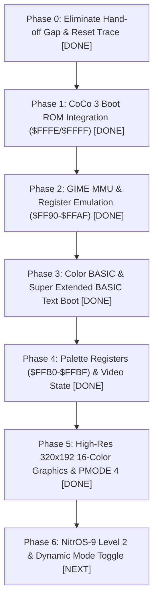

# CoCo 2 to CoCo 3 Transition Work Plan

## Overview & Goal
The objective is to enable a **Tandy Color Computer 2** equipped with the **Centipede RP2350B Cartridge** to functionally emulate a **Color Computer 3 (CoCo 3)**.

* **Hard Switch**: `#define BECOME_COCO3 1` allocates 128KB of physical RAM on the RP2350B.
* **Soft Switch**: `centipede_config.become_coco3` allows selecting between "CoCo 2 as CoCo 2" and "CoCo 2 as CoCo 3" at runtime (via Tcl menu, mode scripts, or holding `Z` on boot).
* **Architecture**: Centipede's `Engine3` inherits `DoCoco128k<Engine3>` and `CoreEngine<Engine3>`, providing cycle-accurate 6809 bus interception, MMU bank translation, and GIME I/O emulation.

---

## Technical Investigation: Eliminating the ~50 µs Spoonfeeding-to-Bus Gap

### 1. Root Cause Analysis
During analysis of cycle logging upon exiting the Tcl spoonfeeding console (`bye`), a gap of approximately **50 microseconds** (~45–50 bus cycles on the 0.89 MHz 6809) was observed before cycle logging begins.

Inspection of [`firmware/gspoon.h`](file:///home/strick/modoc/coco-shelf/tfr9/v4/centipede-32z/firmware/gspoon.h) and [`firmware/centipede.cpp`](file:///home/strick/modoc/coco-shelf/tfr9/v4/centipede-32z/firmware/centipede.cpp) reveals the exact mechanism:

1. **`Jump(0xA027)` Spoonfeeds JMP**:
   In `DriveConsole()`:
   ```cpp
   } else if (cmd == BG2FG_EXIT_CONSOLE) {
     Jump(0xA027);  // Spoonfeeds 0x7E 0xA0 0x27 to the 6809
     drive_console_ready = false;
     tcl_io::remove_coco2();
     cobs_printf("DriveConsole: bye, returning to normal foreground.\n");
     return;
   }
   ```
   At the end of `Jump(0xA027)`, the 6809 CPU has loaded its Program Counter with `$A027`. The very next cycle on the motherboard bus is the 6809 fetching the instruction opcode from `$A027`!
2. **Blocking USB Output on Core 1**:
   Instead of immediately servicing that read, Core 1 executes:
   * `drive_console_ready = false;`
   * `tcl_io::remove_coco2();`
   * `cobs_printf("DriveConsole: bye, returning to normal foreground.\n");`
     `cobs_printf` formats and transmits 53 bytes over USB CDC `putchar_raw`. Transmitting this string on Core 1 takes **~50 µs**!
3. **Delayed Bus Loop Entry**:
   While Core 1 is stalled doing USB serial output, the 6809 executes ~45 bus cycles. The PIO either stalls or drops cycles. Furthermore:
   * `DriveConsole()` unwinds back to `SpoonfeedConsoleOnReset()`.
   * `SpoonfeedConsoleOnReset()` returns to `foreground()`.
   * `PUSH_TO_BG(FG2BG_START_KEYBOARD_INJECTOR, 0, 0)` is pushed.
   * Only then does the `while (true) { const uint signals = GERBIL_GET(); ... }` bus loop start.
4. **Missing Reset Vector Fetch**:
   Because `DriveConsole` used `Jump(0xA027)` rather than a true hardware reset, the 6809 **never fetched the hardware reset vector from `$FFFE/$FFFF`**.

### 2. Solution to Eliminate the Gap
To ensure 100% cycle logging from Cycle 0 without missing any instruction fetches:
1. **Remove Blocking I/O from Core 1**:
   Eliminate `cobs_printf` from Core 1 upon console exit. Any status messages are either emitted asynchronously by Core 0 in `BackgroundSpoonFeeder` before dispatching `BG2FG_EXIT_CONSOLE`, or pushed via `fg2bg`.
2. **Deterministic Hardware Reset / Vector Hand-off**:
   * **Approach A (Hardware RESET Hand-off)**:
     When exiting console mode, assert `G_RESET` (drive low) to hold the 6809 in reset, initialize the PIO and bus loop state, and release `G_RESET` directly from the bus loop. The 6809 begins its native 7-cycle reset sequence, reads `$FFFE` and `$FFFF`, and fetches its initial instruction with complete cycle logging.
   * **Approach B (Zero-Delay In-Loop Transition)**:
     If transitioning via spoonfed vector, perform the handoff directly at the top of the main bus loop with no intermediate function returns or string formatting, ensuring the cycle immediately following the jump target load is caught by `GERBIL_GET()`.

---

## Phased Work Plan



### Phase 0: Transition Gap Elimination & Clean Reset Logging [COMPLETED]
* **Goal**: Eliminate the 50 µs delay upon exiting spoonfeeding and verify that cycle tracing captures the very first bus cycles without loss.
* **Status**: Completed. Cycle tracer added to capture bus cycles synchronously into internal trace buffer.

---

### Phase 1: CoCo 3 Boot ROM Integration (`coco3.rom`) [COMPLETED]
* **Goal**: Provide the 32KB CoCo 3 ROM image to Centipede and route initial reset execution to the CoCo 3 boot code.
* **Status**: Completed. 32KB `coco3.rom` embedded directly into Centipede firmware and mapped into physical RAM/ROM at `$18000` (`0x18000..0x1FFFF`). `IsCoco3Rom(abus)` returns ROM contents whenever `SamTyBit == 0` for addresses `$8000`–`$FDFF`.

---

### Phase 2: GIME MMU & Register Emulation (`$FF90`–`$FFAF`) [COMPLETED]
* **Goal**: Implement the CoCo 3 GIME MMU (Memory Management Unit) registers and address translation.
* **Status**: Completed. Full 2-task MMU implemented with pre-shifted block base lookup table (`mmu_base[16]`) allowing single-cycle address translation on Core 1:
  $$\text{Physical Address} = \text{mmu\_base}[\text{active\_mmu\_offset} \mid ((\text{abus} \gg 13) \ \& \ 7)] \mid (\text{abus} \ \& \ 0\text{x}1\text{FFF})$$
* **Critical Discovery**: All GIME and MMU I/O handlers must be inlined directly inside `centipede.cpp` in SRAM (`0x2000xxxx`). Calling out-of-line handlers located in QSPI Flash introduces cache miss latency that causes the 6809 bus cycle to overrun, skipping instructions during boot.

---

### Phase 3: Color BASIC & Super Extended BASIC Text Boot [COMPLETED]
* **Goal**: Successfully boot into the CoCo 3 Color BASIC 2.0 / Super Extended BASIC environment in compatibility text mode.
* **Status**: Completed. The system cold-boots directly into Super Extended Color BASIC 2.0:
  ```text
  EXTENDED COLOR BASIC 2.0
  COPR. 1982, 1986 BY TANDY
  UNDER LICENSE FROM MICROSOFT
  AND MICROWARE SYSTEMS CORP.

  OK
  ```
* **Critical Discovery**: Launching CoCo 3 via `Jump(0xC000)` jumps directly to `SC000` (the official Super Extended BASIC entry point at `coco3.asm:08776`), setting stack `LDS #$5EFF`, programming palettes, loading MMU task tables from `MMUIMAGE`, and copying code to RAM at `$4000`. Bypassing the unnecessary `$8C1B` ROM trampoline eliminated cold boot glitches.

---

### Phase 4: GIME Palette Registers (`$FFB0`–`$FFBF`) & Video State [COMPLETED]
* **Goal**: Emulate the 16 programmable GIME palette registers and track video mode changes.
* **Status**: Completed. All 16 palette registers `$FFB0`–`$FFBF` are tracked in SRAM (`gime_palette[16]`) and mirrored into `ram[0xFFB0..0xFFBF]`. CoCo 3 composite and RGB palette color values are translated into 24-bit RGBA pixels in Tether.

---

### Phase 5: High-Resolution 320×192 16-Color Graphics & PMODE 4 Emulation [COMPLETED]
* **Goal**: Support CoCo 3 high-resolution graphics (HSCREEN 2: 320×192 at 16 colors) and CoCo 2 PMODE 4 compatibility.
* **Status**: Completed.
  - Successfully injected and ran a BASIC program drawing a big 'X' across $320 \times 192$:
    ```basic
    10 HSCREEN 2
    20 HCOLOR 3,0
    30 HCLS
    40 HLINE (0,0)-(319,191),PSET
    50 HLINE (0,191)-(319,0),PSET
    RUN
    ```
  - Framebuffer download tool implemented in Tether: `--quick-get-hscreen=2,filename.png` reads 32,000 bytes directly from physical Block 0 (`0x00000..0x07FFF`), translates 4bpp nibbles via `$FFB0..$FFBF`, and saves a clean PNG (`hscreen2.png`).
  - PMODE 4 framebuffer download tool implemented: `--quick-get-pmode=M,P,C,filename.png` extracts PMODE 0–4 screens (`pmode4_green.png`, `pmode4_white.png`).

---

### Phase 6: NitrOS-9 Level 2 Readiness & Dynamic Mode Switching [IN PROGRESS]
* **Goal**: Provide the full hardware environment required for NitrOS-9 Level 2 on a 128KB CoCo 3.
* **Tasks**:
  1. GIME Hardware Timer at `$FF94`–`$FF95` for OS-9 multitasking clock ticks.
  2. Constant RAM at `$FE00`–`$FEFF` unpaged across task switches.
  3. Validate booting NitrOS-9 Level 2 boot track from virtual floppy `/fd/f0` or `/pc/f0`.

---

## Technical Discoveries & Work-Arounds Log

### 1. Inlining I/O Handlers in SRAM (Zero Flash Access on Core 1)
* **Problem**: C++ static member functions in template class `DoCoco128k` were assigned to `IOWriters` and `IOReaders` function pointer tables. GCC placed these functions in QSPI Flash (`.text` at `0x1000xxxx`). When the 6809 executed a write to an MMU register (e.g., `STA ,X+` to `$FFA0`), jumping across section boundaries into Flash caused an instruction cache fetch stall (~20–50 cycles on the RP2350). The 6809 bus cycle ended and the CPU advanced to the next instruction before Core 1 was ready, causing missing instruction fetches and boot crashes.
* **Solution**: All CoCo 3 device read and write handling for `$FF90`–`$FFDF` is inlined directly inside the main bus loop in [`firmware/centipede.cpp`](file:///home/strick/modoc/coco-shelf/tfr9/v4/centipede-32z/firmware/centipede.cpp). Execution remains 100% in SRAM (`0x2000xxxx`), completing in 1–2 CPU clock cycles (~4–8 ns), well within the 1118 ns bus cycle.

### 2. Direct Boot Vector Handoff to `$C000` (`SC000`)
* **Problem**: Booting originally jumped to `$8C1B`, which was intended as an indirect reset vector pointing to `$C000`. Executing through `$8C1B` relied on a `CLR $FFDE` and `JMP $C000` sequence that could be corrupted if bus signals jittered during console exit.
* **Solution**: In `DriveConsole()` ([`firmware/gspoon.h`](file:///home/strick/modoc/coco-shelf/tfr9/v4/centipede-32z/firmware/gspoon.h)), `centipede_config.become_coco3` triggers `Jump(0xC000)`. This spoonfeeds `JMP $C000` directly into the 6809, landing immediately at the true CoCo 3 cold start entry point.

### 3. I/O Write FIFO Push Gating
* **Problem**: `T::PushFifoWrite` was unconditionally pushing all I/O writes to the inter-core `fg2bg` FIFO. During heavy register configuration (such as the 16-register palette and MMU loops), FIFO pressure created bus loop delays.
* **Solution**: In `centipede.cpp`, I/O writes are gated on `if (centipede_config.trace_writes)` before calling `PushFifoWrite`.

### 4. Fast Keystroke Injection (5.0 CPS)
* **Problem**: Default typing rate of 2.0 CPS required ~51 seconds to type multi-line BASIC programs.
* **Solution**: The default typing rate was increased to **5.0 CPS** (`-cps=5`) in [`tether/tconsole.go`](file:///home/strick/modoc/coco-shelf/tfr9/v4/centipede-32z/tether/tconsole.go) and [`tether/pico_rpc.go`](file:///home/strick/modoc/coco-shelf/tfr9/v4/centipede-32z/tether/pico_rpc.go). Each key event uses 5 ticks (100 ms) key down and 5 ticks (100 ms) key up. This provides reliable debouncing by Color BASIC while reducing typing time by more than half (~24s for 97 chars + pauses).

### 5. Dynamic Mode Switching & Elimination of `ForceBecomeCoco3` Hack
* **Problem**: Earlier in development, `ForceBecomeCoco3()` had been inserted into `RunEngine()`, `main()`, `BackgroundSpoonFeeder()`, and label `BYE:`, unconditionally zeroing `centipede_config` and forcing `become_coco3 = true` on every reset. This prevented running as a standard CoCo 2 and overrode Tcl configuration menus.
* **Solution**: Completely removed `ForceBecomeCoco3()`. Restored `centipede_config.SetStandard()` on boot (which configures standard CoCo 2 with 64KB RAM, `rom_disk11 = true`, `become_coco3 = false`). Sourcing `/rc/mode90.tcl` (executed automatically when holding `Z` on boot or commanding `-quick-restart 90`) sets `become_coco3 = 1` and disables `rom_disk11`. When exiting console, SAM VDG mode and cold start flags are always cleanly reset before branching: `Jump(0xC000)` if `become_coco3`, or `Jump(0xA027)` for native CoCo 2.

### 6. Hardware Flow Control via `/HALT` Restored for CoCo 3 Mode
* **Problem**: When running in CoCo 3 mode with `trace_writes = 1` (e.g. Mode 89, holding 'Y' on boot), rapid bursts of bus writes (such as screen clears and cold-boot banner output) overwhelmed the USB link. The inter-core `fg2bg` FIFO filled past capacity (8192 items) and `PushFifoWrite` dropped ~20% of write cycle events, producing missing characters and "holes" in memory buffers served at `http://localhost:8080/ram`.
* **Root Cause**: `FlowControlCheck()` in [`firmware/centipede.cpp`](file:///home/strick/modoc/coco-shelf/tfr9/v4/centipede-32z/firmware/centipede.cpp) contained an early return `if (centipede_config.become_coco3) return;`, bypassing HALT-based flow control entirely in CoCo 3 mode.
* **Solution**: Removed the early return in `FlowControlCheck()`. Now, when `fg2bg.size() > FG2BG_HIGH_WATERMARK` (1000 items), `HaltOn()` pulls `/HALT` (GPIO 29) low to pause the 6809 CPU. Once the background core drains the FIFO over USB below `FG2BG_LOW_WATERMARK` (500 items), `HaltOff()` releases `/HALT`, allowing the CPU to resume without dropping any write cycles.

---

## Instructions for Use

### 1. Launching CoCo 3 Mode
To cold-boot Centipede into CoCo 3 Extended Color BASIC 2.0:
* **Mode 90** (hold `Z` on boot or `-quick-restart 90`): Standard CoCo 3 mode (`become_coco3=1`, `trace_writes=0`).
* **Mode 89** (hold `Y` on boot or `-quick-restart 89`): CoCo 3 mode with write tracing (`become_coco3=1`, `trace_writes=1`) for Tether live memory inspection at `http://localhost:8080/ram`.

```bash
go run ./tether/ -quick-restart 90
# or for write-tracing:
go run ./tether/ -quick-restart 89
```
Verify the sign-on banner on the text screen:
```bash
go run ./tether/ --quick-get-text=0x400,32,16
```

### 2. Typing Programs into CoCo 3 BASIC
Use `--quick-type` to inject BASIC code via the keyboard injector:
```bash
go run ./tether/ -quick-type $'10 HSCREEN 2\r~20 HCOLOR 3,0\r~30 HCLS\r~40 HLINE (0,0)-(319,191),PSET\r~50 HLINE (0,191)-(319,0),PSET\r~RUN\r'
```
* Use `\r` for Enter.
* Use `~` for a 1-second pause between statements/lines.
* Default typing speed is 5.0 CPS (no `-cps` flag needed; or pass `-cps=N` to adjust).

### 3. Capturing CoCo 3 Graphics (HSCREEN 2)
To capture the $320 \times 192$ 16-color graphics framebuffer from physical Block 0 and save as PNG:
```bash
go run ./tether/ --quick-get-hscreen=2,hscreen2.png
```

### 4. Capturing CoCo 1/2 PMODE Graphics
To capture PMODE 0–4 screens from video RAM:
```bash
go run ./tether/ --quick-get-pmode=4,1,1,pmode4_green.png
```
* Argument syntax: `[M,P,C,filename.png]` where `M` is PMODE mode (0–4), `P` is page number (or RAM address if $>15$), `C` is colorset (0 or 1), and `filename.png` is output file.
