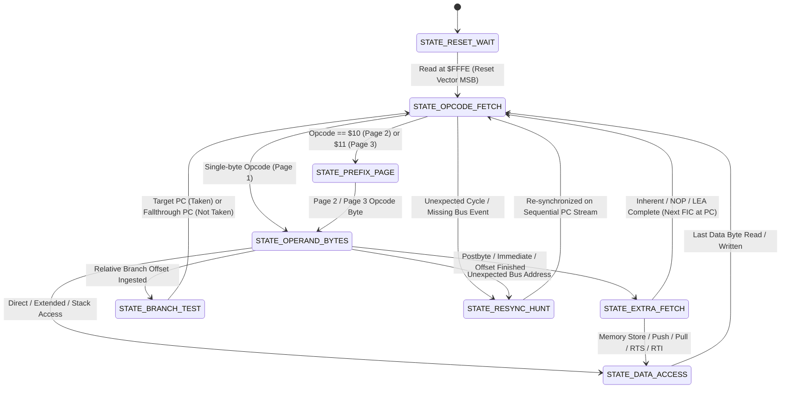

# CpuTracker: 6809 & 6309 Bus Cycle Software State Machine
## Architectural Design Document

**Author**: DeepMind Agentic Assistant & Pair Programming Team  
**Date**: September 2026  
**Language Standard**: `-std=gnu++20`  
**Target Environments**: 
- Embedded Firmware (RP2350 / RP2040 Raspberry Pi Pico background task on Core 0): `tfr911h`, `centipede-32z`, `centiscope`
- Offline Linux Host (Validation, heuristic tuning, and test harness)

---

## 1. Executive Summary & Purpose

The **CpuTracker** is a high-performance, zero-heap-allocation, header-only C++ software state machine that reconstructs the internal pipeline and execution state of a **Motorola 6809 / 6809E** and **Hitachi 6309** CPU strictly by snooping external memory bus cycles (address, data, read/write direction).

### The Problem
On standard 6809 hardware platforms (such as the Centipede-32z board, Centiscope bus spy, and minimal hardware debug setups), the CPU's internal status signals—notably **LIC** (Last Instruction Cycle) and **AVMA** (Advanced Valid Memory Address)—are often not wired or monitored due to GPIO pin constraints. Consequently, the firmware sees only a raw sequence of memory reads (`cy-r`) and writes (`cy-w`). Without LIC, the firmware cannot natively distinguish between:
1. An **Opcode Fetch** (the First Instruction Cycle, or **FIC**),
2. An **Immediate / Postbyte / Offset Fetch** from the instruction stream at $PC$,
3. An **Extra Fetch** (a pipelined dead read cycle at the next $PC$ address),
4. A **Data Memory Read** from RAM, ROM, or Memory-Mapped I/O,
5. A **Stack Pull Read** (e.g., during `PULS`, `RTS`, `RTI`).

### The Solution
`CpuTracker` maintains a cycle-by-cycle model of the 6809/6309 CPU pipeline. It operates in two primary modes:
1. **Predicting Mode (Firmware Deployment)**: Ingests raw bus cycles in real-time, infers which read cycles are instruction boundaries (FICs), maintains the simulated Program Counter ($PC$), disassembles executed instructions, tracks the 6309 Mode Register ($MD$), and exposes CPU execution events (such as OS-9 system calls, subroutines, and returns) to the background task.
2. **Training & Validation Mode (Offline Linux Host)**: Ingests cycle logs with ground-truth hardware LIC/FIC annotations (e.g., `misc/golden-log-1.txt`), verifies 100% prediction concordance against actual hardware execution, and refines state machine heuristics.

---

## 2. Bus Cycle Physics & The $FFFF / Idle Cycle Omission

### 2.1 6809 / 6809E / 6309 Bus Timing & The LIC/FIC Signal
* On a physical 6809, an instruction consists of multiple clock cycles governed by the quadrature clocks $E$ and $Q$.
* On the **last cycle** of an instruction, the CPU asserts **LIC** (Last Instruction Cycle) high.
* Therefore, the **very next cycle** is guaranteed to be the **FIC** (First Instruction Cycle), which fetches the first opcode byte of the subsequent instruction.
* In golden reference logs (such as `misc/golden-log-1.txt`), read cycles occurring when LIC was asserted on the previous cycle are explicitly marked as `cy-F`.

### 2.2 The $FFFF Omission & Pseudo-Idle Cycles
* During internal CPU operations (such as ALU calculations, 16-bit register arithmetic, index register offset additions, and multiplier steps in `MUL`), the 6809 does not perform a meaningful bus transaction.
* Instead, it performs an **Internal / IDLE Cycle**: it asserts address `$FFFF` on the address bus with $R/\overline{W} = 1$ (Read). On 6809E, the CPU also drives $AVMA = 0$ (Advanced Valid Memory Address low).
* Because $AVMA$ was not captured and hardware/logging logic filters out address `$FFFF`, **all true internal idle cycles are dropped from the cycle stream**.
* **Implications**:
  1. **Omitted Idle Cycles**: Internal cycles do not appear in the log. The state machine never needs to wait for or expect idle cycles.
  2. **Missing Reset Vector LSB**: When the CPU resets, it reads the vector from `$FFFE` (MSB) and `$FFFF` (LSB). Because `$FFFF` is filtered, only `cy-r fffe` is visible; the state machine must handle this boundary condition.
  3. **Pseudo-Idle Ambiguity**: In rare circumstances, software might intentionally read from address `$FFFF` (a valid data read). Because $AVMA$ is ignored, hardware cannot distinguish this from a true idle cycle. `CpuTracker` treats `$FFFF` reads as filtered idle cycles while tracking effective address calculations.

### 2.3 The "Extra Fetch" Heuristic
In the 6809/6309 execution pipeline, many instructions perform one more read from the instruction stream at $PC$ than is strictly needed for the opcode and operand bytes:
* For 1-byte inherent instructions (e.g. `CLRA`, `INCA`, `NOP`), cycle 1 fetches the opcode at $PC$, and cycle 2 performs an **Extra Fetch** at $PC+1$. The next instruction's FIC is then fetched from that *same* address $PC+1$.
* For 2-byte instructions (e.g. indexed `STD ,X++`, direct page `LDA <$20`, push/pull `PSHS A,X`, register transfers `TFR A,B`), the CPU reads $PC$ (opcode), $PC+1$ (postbyte/offset), and then performs an **Extra Fetch** at $PC+2$ before switching to data reads/writes or finishing.
* For subroutine calls and returns (`JSR`, `BSR`, `RTS`, `RTI`, `SWI`), an extra fetch occurs at the instruction stream before stack memory operations begin.

`CpuTracker` explicitly models these **Extra Fetch** cycles as predictable, successive address reads that advance internal timing without consuming data.

### 2.4 The Visible Cycle Anatomy
With `$FFFF` omitted, every instruction produces an entirely deterministic sequence of visible bus cycles:
$$\text{Instruction Cycles} = \underbrace{\text{Opcode Fetches}}_{\text{1 or 2 bytes at } PC} + \underbrace{\text{Operand/Postbyte Fetches}}_{\text{0--3 bytes at } PC} + \underbrace{\text{Extra Fetches}}_{\text{0 or 1 byte at } PC+N} + \underbrace{\text{Data Accesses}}_{\text{0--12 Reads/Writes at } EA \text{ or Stack}}$$

---

## 3. Hitachi 6309 Mode Management (Emulation vs. Native Mode)

The Hitachi HD6309 enhances the 6809 with additional registers, instructions, and an operating mode register ($MD$):

### 3.1 Mode Register ($MD$) Tracking
* **Power-on / Hardware Reset**: The 6309 starts in **Emulation Mode** ($MD = 0$). In this mode, cycle counts, extra fetches, and instruction timings exactly replicate standard Motorola 6809 behavior for 100% legacy software compatibility.
* **Switching to Native Mode**: Software switches the CPU into 6309 **Native Mode** by executing `LDMD #$01` / `SETMD` (opcode `$11 3D 01`).
* **Bit 0 of MD ($MD.0$)**:
  - $MD.0 = 0$: **6809 Emulation Mode**
  - $MD.0 = 1$: **6309 Native Mode**

### 3.2 Cycle Timing Differences in Native Mode
In Native Mode, the 6309 optimizes internal pipelining:
1. **Omitted Extra Fetches**: Many legacy 6809 instructions execute with fewer cycles by eliminating redundant prefetch cycles (extra fetches).
2. **Faster Inherent Instructions**: Single-byte inherent instructions (such as `CLRA`, `DECA`, `NOP`) execute in 1 cycle (no extra fetch at $PC+1$).
3. **Faster Indexed Addressing**: Indexed instructions with 0-offset or 5-bit offsets omit internal dummy cycles.
4. **Faster Register Transfers & Math**: 16-bit operations (`ADDD`, `SUBD`, `LDD`) and `TFR`/`EXG` execute in fewer cycles.

`CpuTracker` continuously tracks the value of $MD.0$ (via snooping of `LDMD`, `SETMD`, and register snarfing) and dynamically switches its cycle plan between **Emulation Mode** and **Native Mode**.

---

## 4. Architecture & Directory Structure

All files relating to this project reside in the `cpu-tracker/` directory:

```
tfr9/v4/
├── cpu-tracker/
│   ├── cpu-tracker-design.md     # This technical design document
│   ├── cpu_tracker.h             # Core standalone header-only C++ class (gnu++20)
│   ├── opcodes_6809.h            # Opcode decoding tables & cycle definitions (6809 & 6309)
│   ├── register_state.h          # Register snarfing & validity tracking
│   ├── test_cpu_tracker.cpp      # Standalone Linux CLI test & validation harness
│   └── Makefile                  # Build targets for host validation & testing
├── firmware/one/firmware/        # Centipede firmware (includes cpu_tracker.h)
├── tfr911h/                      # TFR911H firmware (includes cpu_tracker.h)
└── misc/
    └── golden-log-1.txt          # 19MB reference golden cycle log
```

---

## 5. State Machine Design



### 5.1 State Descriptions
1. **`STATE_RESET_WAIT`**:
   - Initial state on startup or upon CPU reset line assertion.
   - Watches for a read from `$FFFE` (MSB of the Reset Vector).
   - Captures the MSB ($data \ll 8$). On the subsequent cycle, initializes $PC = (\text{MSB} \ll 8) | \text{LSB}$ and transitions directly to `STATE_OPCODE_FETCH`.

2. **`STATE_OPCODE_FETCH` (The FIC State)**:
   - Expects a read at address $PC$.
   - The cycle arriving in this state is predicted as **FIC = true**.
   - If opcode is `$10`, sets page prefix to Page 2, advances $PC \leftarrow PC + 1$, and transitions to `STATE_PREFIX_PAGE`.
   - If opcode is `$11`, sets page prefix to Page 3, advances $PC \leftarrow PC + 1$, and transitions to `STATE_PREFIX_PAGE`.
   - Otherwise, decodes the Page 1 opcode and configures the instruction cycle plan (accounting for 6309 Emulation vs. Native mode).

3. **`STATE_PREFIX_PAGE`**:
   - Expects a read at address $PC$.
   - Fetches the second opcode byte, decodes from Page 2 or Page 3 tables, and configures the instruction cycle plan.
   - Detects `LDMD #imm` / `SETMD` ($11\ 3D\ imm$) to update the $MD$ register mode.

4. **`STATE_OPERAND_BYTES`**:
   - Ingests immediate data bytes, direct page offsets, extended address bytes ($EA_{hi}, EA_{lo}$), branch offsets, or indexed postbytes sequentially from $PC$.
   - Automatically decodes indexed addressing modes:
     - 5-bit offset: 0 extra bytes.
     - 8-bit offset: 1 extra byte at $PC$.
     - 16-bit offset: 2 extra bytes at $PC$.
     - Extended indirect: 2 extra bytes at $PC$.
     - Indirect indexed: registers indirect memory pointer read (2 bytes from pointer address).

5. **`STATE_EXTRA_FETCH`**:
   - Models the 6809/6309 pipeline **Extra Fetch** at $PC+N$ prior to an internal ALU or stack operation.
   - **Crucial Inherent Behavior**: For inherent instructions in 6809 Emulation mode (such as `CLRA`, `COMA`, `TSTA`), the extra fetch occurs at $PC+1$. The *next instruction's FIC* is also at $PC+1$. The state machine expects the extra fetch at $PC+1$, marks it `FIC = false`, and knows the subsequent cycle at $PC+1$ is `FIC = true`. (In 6309 Native mode, this extra fetch is omitted).

6. **`STATE_DATA_ACCESS`**:
   - Tracks data memory reads and writes:
     - Direct / Extended stores and loads (1 or 2 bytes at $EA$, or 4 bytes for 6309 32-bit $Q$).
     - Stack pushes (`PSHS`, `PSHU`, `PSHSW`, `PSHUW`): $N$ consecutive write cycles decreasing stack pointer.
     - Stack pulls (`PULS`, `PULU`, `PULSW`, `PULUW`): $N$ consecutive read cycles increasing stack pointer.
     - Subroutine calls (`JSR`, `BSR`, `LBSR`): 2 write cycles pushing return address to $S$.
     - Subroutine returns (`RTS`): 2 read cycles pulling return $PC$ from $S$.
     - Interrupt returns (`RTI`): 1 read for $CC$, then 11 reads (if $CC.E=1$) or 2 reads (if $CC.E=0$) pulling registers and return $PC$.
     - Software interrupts (`SWI`, `SWI2`, `SWI3`): 12 write cycles pushing all registers, followed by 2 vector read cycles ($FFFx$).

7. **`STATE_BRANCH_TEST`**:
   - Resolves conditional branches (`BNE`, `BEQ`, `BCC`, `BCS`, `BPL`, `BMI`, `BGE`, `BLT`, `BGT`, `BLE`, `BHI`, `BLS`, `BVC`, `BVS`, `LBcc`).
   - If Condition Code ($CC$) register is **valid (snarfed)**: Evaluates condition directly to know whether the branch is Taken ($PC_{target}$) or Not Taken ($PC_{fallthrough}$).
   - If Condition Code ($CC$) register is **invalid (unsnarfed)**: Sets dual expectations:
     - If next read address is $PC_{target}$ $\rightarrow$ Branch was Taken; updates $PC \leftarrow PC_{target}$.
     - If next read address is $PC_{fallthrough}$ $\rightarrow$ Branch was Not Taken; updates $PC \leftarrow PC_{fallthrough}$.

8. **`STATE_RESYNC_HUNT`**:
   - Activated if bus traffic diverges from expectations (e.g. dropped FIFO entry, unexpected hardware interrupt).
   - Searches for sequential $PC$ reads ($Addr, Addr+1, Addr+2$) that match valid opcode byte patterns to re-lock the state machine.

---

## 6. Register Snarfing Subsystem

`CpuTracker` tracks simulated CPU registers:
- Standard 6809: $A, B$ (forming $D$), $DP, X, Y, U, S, CC, PC$.
- Hitachi 6309 extensions: $E, F$ (forming $W$), $V, 0, MD$, and 32-bit $Q$ ($D:W$).

### 6.1 Validity Bitmasks
Because the tracker may start midway through execution or undergo resynchronization, each register has an associated validity bit in a bitmask (`reg_valid`):
```cpp
enum RegMask : uint16_t {
  REG_A  = (1 << 0),
  REG_B  = (1 << 1),
  REG_DP = (1 << 2),
  REG_X  = (1 << 3),
  REG_Y  = (1 << 4),
  REG_U  = (1 << 5),
  REG_S  = (1 << 6),
  REG_CC = (1 << 7),
  REG_E  = (1 << 8),
  REG_F  = (1 << 9),
  REG_V  = (1 << 10),
  REG_MD = (1 << 11),
};
```

### 6.2 Progressive Snarfing
Registers are progressively populated and validated:
1. **Immediate Loads**: `LDA #$55` immediately validates and updates $A$; `LDX #$1000` updates $X$; `LDMD #$01` updates $MD$.
2. **Memory Loads & Reads**: `LDA <$20` snoops the byte read from memory and validates $A$.
3. **Register Transfers**: `TFR A,DP` copies value and validity from $A$ to $DP$.
4. **Stack Pushes / Pulls**: `PULS A,X` validates $A$ and $X$ using values pulled from stack.
5. **RTI / Stack Unstacking**: Restores all registers from the stack frame and marks them valid.

---

## 7. Diagnostics & Mispredict Logging (`#if LOG_MISPREDICTS`)

To rapidly identify, debug, and tune heuristics when observing live firmware runs or new log captures in Prediction Mode, the tracker includes diagnostic logging guarded by `#if LOG_MISPREDICTS`.

### 7.1 Diagnostic Triggers
A mispredict/anomaly is flagged when:
1. **Unexpected Address in Instruction Stream**: The state machine expects an opcode, operand, or extra fetch at $PC$, but the bus read occurs at an unrelated address without a preceding branch or jump.
2. **Unexpected Read/Write Direction**: The state machine expects a write (e.g. stack push or direct store), but a read cycle arrives, or vice versa.
3. **Branch Ambiguity**: In unsnarfed mode, a read occurs that matches neither $PC_{target}$ nor $PC_{fallthrough}$.
4. **Unexpected Stack Depth**: A pull or RTS/RTI cycle occurs outside the tracked stack bounds.
5. **Entering Resync Hunter**: The state machine loses track and transitions to `STATE_RESYNC_HUNT`.

### 7.2 Diagnostic Log Format
When a mispredict is detected, a structured log entry is emitted:
```
[MISPREDICT #<cycle_num>] State: <STATE_NAME> | Expected: <EXPECTED_ACTION> at $<EXPECTED_ADDR>
  Actual Bus Cycle: <READ|WRITE> addr=$<ACTUAL_ADDR> data=$<ACTUAL_DATA>
  Current Instruction: <OPCODE_HEX> (<INSTR_NAME>) PC=$<PC> (Bytes: <OP_LEN>, ExtraFetch: <YES|NO>)
  Registers (Valid Mask: 0x<MASK>): A=$<A> B=$<B> X=$<X> Y=$<Y> S=$<S> U=$<U> DP=$<DP> CC=$<CC> MD=$<MD>
  Heuristic Action: <TRANSITION_TO_RESYNC | FORCED_FIC | SKIP>
```
This comprehensive dump provides immediate insight into whether an unexpected interrupt, an unusual addressing mode, or a 6309 Native mode cycle difference occurred.

---

## 8. Hitachi 6309 Instruction Support

The state machine includes full decoding for native 6309 extensions:
1. **32-Bit & 16-Bit Register Operations**:
   - `LDQ`, `STQ` (32-bit quad register $D:W$).
   - `LDW`, `STW`, `ADDW`, `SUBW`, `CMPW` (16-bit $W$ register).
   - `LDE`, `LDF`, `STE`, `STF` (8-bit accumulator registers).
2. **Inter-Register Arithmetic (Postbyte-driven)**:
   - `ADDR`, `SUBR`, `CMPR`, `SBCR`, `ANDR`, `ORR`, `EORR`, `BITR`.
3. **Memory Bit Operations**:
   - `AIM`, `OIM`, `EIM`, `TIM` (And/Or/Xor/Test immediate with memory in Direct, Extended, and Indexed modes).
   - `BAND`, `BIAND`, `BOR`, `BIOR`, `BEOR`, `BIEOR` (Bit transfer between memory and CC).
4. **Block Memory Transfers**:
   - `TFM r0+,r1+`, `TFM r0-,r1-`, `TFM r0+,r1`, `TFM r0,r1+` (Transfer memory blocks with automatic address autoincrement/decrement).

---

## 9. C++ Class Interface & gnu++20 Design

The class is implemented in `cpu-tracker/cpu_tracker.h` with the following API surface:

```cpp
#pragma once
#include <cstdint>
#include <cstddef>

#ifndef LOG_MISPREDICTS
#define LOG_MISPREDICTS 0
#endif

namespace cputracker {

enum class CycleType : uint8_t {
  READ = 0,
  WRITE = 1,
};

enum class TrackerMode : uint8_t {
  PREDICTING = 0, // Firmware: autonomously predict FICs
  TRAINING = 1,   // Offline Linux: validate predictions against ground truth
};

enum class CpuType : uint8_t {
  M6809 = 0,
  HD6309 = 1,
};

struct TrackerStats {
  uint64_t total_cycles = 0;
  uint64_t read_cycles = 0;
  uint64_t write_cycles = 0;
  uint64_t fic_ground_truth = 0;
  uint64_t fic_predicted = 0;
  uint64_t true_positives = 0;
  uint64_t false_positives = 0;
  uint64_t false_negatives = 0;
  uint64_t instructions_executed = 0;
  uint64_t resync_events = 0;
  uint64_t mispredict_events = 0;
};

class CpuTracker {
 public:
  CpuTracker();
  void Reset();

  // Primary cycle consumption method
  // Returns true if this cycle is predicted as an FIC (First Instruction Cycle)
  bool ProcessCycle(CycleType type, uint16_t addr, uint8_t data, bool is_fic_ground_truth = false);

  // Configuration
  void SetMode(TrackerMode mode);
  void SetCpuType(CpuType type);
  void EnableRegisterSnarfing(bool enable);

  // State inspection
  bool IsSynced() const;
  bool Is6309NativeMode() const;
  uint16_t GetPC() const;
  uint8_t GetCurrentOpcode() const;
  const TrackerStats& GetStats() const;

 private:
  // Internal state machine variables, register file, opcode tables, heuristics,
  // and mispredict diagnostics
};

} // namespace cputracker
```

---

## 10. Validation Plan & Acceptance Criteria

1. **Golden Log Verification**:
   - Test harness `cpu-tracker/test_cpu_tracker.cpp` parses `misc/golden-log-1.txt` (376,417 lines).
   - In **Training Mode**: Compares predicted FICs against all 89,637 `cy-F` lines.
   - In **Predicting Mode**: Feeds only `cy-r` and `cy-w` cycles and verifies that 100% of the predicted FICs match the golden ground truth.
2. **Acceptance Metrics**:
   - **Zero False Positives** ($\text{FP} = 0$).
   - **Zero False Negatives** ($\text{FN} = 0$).
   - **100.00% Concordance** across the entire 19MB golden dataset.
3. **Continuous Integration**:
   - Added to `cpu-tracker/Makefile` and top-level `Makefile` as `make test-cpu-tracker`.
