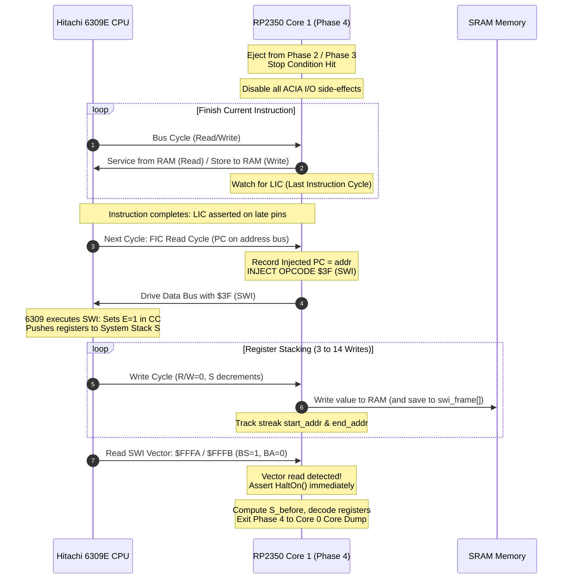

# Phase Four with SWI Injection: Architecture & Design

## 1. Overview & Objective

When the 6309 SBC execution in **Phase 2** (untraced execution) or **Phase 3** (active tracing) reaches a stopping condition—such as `max_cycles`, `max_time_us`, a hardware/bus fault (Red Page, Zero Vector), or a host $^C$ interrupt—we currently assert `HaltOn()` immediately. While this freezes the CPU and allows Core 0 to dump the 64KB RAM image, all internal CPU registers ($PC, A, B, X, Y, U, S, CC, DP$, and native 6309 registers $E, F$) are lost.

Earlier, an NMI-based trap was considered. However, injecting an **`SWI` ($3F)** instruction directly onto the data bus during a Fetch Instruction Code (FIC) read cycle provides significant advantages:
1. **Instruction Boundary Alignment**: SWI executes cleanly between instructions rather than interrupting mid-instruction.
2. **Zero Hardware Wiring**: Does not rely on asserting external hardware interrupt pins (NMI/IRQ), avoiding edge/level contention and pull-up delay.
3. **Automatic Register Stacking**: Both the 6809 and 6309 automatically push their entire register set onto the system stack ($S$) as part of executing `SWI`.
4. **Non-Intrusive to I/O**: Once Phase 4 is entered, real ACIA UART and timer I/O operations are disabled, preventing spurious side-effects while registers are dumped.

---

## 2. Bus Dynamics & The Injection Sequence



### Step-by-Step Bus Mechanics

1. **Ejection into Phase 4**:
   - Triggered by `max_cycles`, `max_time_us`, a fault, or tether interruption.
   - Core 1 disables all ACIA I/O operations (reads return `$00`, writes are ignored or treated as plain RAM).
2. **Finishing Current Instruction**:
   - The CPU may be on cycle 2 of an 8-cycle instruction (e.g. `STD ,X++`).
   - Core 1 services ordinary read/write cycles from RAM until the late pins indicate `LIC == 1` (Last Instruction Cycle).
3. **SWI Injection on FIC Cycle**:
   - On the cycle immediately following `LIC == 1`, the 6309 performs an opcode read:
     - `reading == true`
     - `addr` is the Program Counter ($PC$) of what would have been the next instruction.
   - Core 1 intercepts this read:
     - Records `injected_pc = addr`.
     - Puts `$3F` (`SWI`) onto the PIO data bus instead of `ram[addr]`.
     - The CPU latches `$3F` as its instruction opcode.
4. **Register Push Write Streak**:
   - The CPU executes `SWI`, setting $E=1$ (Entire flag) in $CC$.
   - The CPU initiates a contiguous streak of memory write cycles to the stack ($S$):
     - First write is to $S_{init} - 1$
     - Subsequent writes decrement $S$ down to $S_{final}$.
   - Core 1 monitors the bus:
     - Confirms `reading == false`.
     - Saves the first write address as `write_start`.
     - Saves each written byte into a local capture array `swi_stack_bytes[]`.
     - Updates `write_end` on each write.
5. **Streak Length & Interrupt Mode Detection**:
   - **Streak of 3 writes ($S_{init} - S_{final} = 3$)**: A **FIRQ** was in progress or triggered right before SWI. FIRQ pushes only $PC$ (2 bytes) and $CC$ (1 byte with $E=0$).
     - *Action*: Core 1 lets the FIRQ vector ($FFF6/$FFF7) be read, remains in Phase 4, and injects `$3F` on the first FIC read of the FIRQ handler.
   - **Streak of 12 writes ($S_{init} - S_{final} = 12$)**: Standard **6809 mode** full register push ($PC, U, Y, X, DP, B, A, CC$).
   - **Streak of 14 writes ($S_{init} - S_{final} = 14$)**: Native **6309 mode** full register push ($PC, U, Y, X, DP, F, E, B, A, CC$).
6. **Vector Read Detection & Final Halt**:
   - Following the register push (and an optional internal idle cycle), the 6309 reads the interrupt vector from `$FFFA` and `$FFFB` with bus status **$BS=1, BA=0$** (Interrupt Acknowledge).
   - Upon observing this vector read following a valid 12- or 14-byte write streak:
     - Core 1 immediately calls `HaltOn()`.
     - Calculates initial Stack Pointer: $S_{init} = \text{write\_start} + 1$.
     - Unpacks the captured frame into structured register variables.
     - Exits `foreground_loop()` back to Core 0.

---

## 3. Register Frame Layouts

### 6809 Emulation Mode (12-Byte Frame)

Pushed in descending address order from $S_{init} - 1$ down to $S_{final}$:

| Offset from $S_{final}$ | Register | Size | Description |
| :---: | :---: | :---: | :--- |
| `+11` | $PC_{high}$ | 1 byte | High byte of Program Counter |
| `+10` | $PC_{low}$  | 1 byte | Low byte of Program Counter |
| `+9`  | $U_{high}$  | 1 byte | User Stack Pointer High |
| `+8`  | $U_{low}$   | 1 byte | User Stack Pointer Low |
| `+7`  | $Y_{high}$  | 1 byte | Index Register Y High |
| `+6`  | $Y_{low}$   | 1 byte | Index Register Y Low |
| `+5`  | $X_{high}$  | 1 byte | Index Register X High |
| `+4`  | $X_{low}$   | 1 byte | Index Register X Low |
| `+3`  | $DP$        | 1 byte | Direct Page Register |
| `+2`  | $B$         | 1 byte | Accumulator B |
| `+1`  | $A$         | 1 byte | Accumulator A |
| `+0`  | $CC$        | 1 byte | Condition Code Register (with bit 7 $E=1$) |

Initial Stack Pointer: $S_{init} = S_{final} + 12$.

---

### 6309 Native Mode (14-Byte Frame)

When the 6309 is in native mode (MD bit 0 = 1), it pushes its additional accumulators ($E$ and $F$, composing the 16-bit $W$ register):

| Offset from $S_{final}$ | Register | Size | Description |
| :---: | :---: | :---: | :--- |
| `+13` | $PC_{high}$ | 1 byte | High byte of Program Counter |
| `+12` | $PC_{low}$  | 1 byte | Low byte of Program Counter |
| `+11` | $U_{high}$  | 1 byte | User Stack Pointer High |
| `+10` | $U_{low}$   | 1 byte | User Stack Pointer Low |
| `+9`  | $Y_{high}$  | 1 byte | Index Register Y High |
| `+8`  | $Y_{low}$   | 1 byte | Index Register Y Low |
| `+7`  | $X_{high}$  | 1 byte | Index Register X High |
| `+6`  | $X_{low}$   | 1 byte | Index Register X Low |
| `+5`  | $DP$        | 1 byte | Direct Page Register |
| `+4`  | $F$         | 1 byte | Accumulator F (low byte of W) |
| `+3`  | $E$         | 1 byte | Accumulator E (high byte of W) |
| `+2`  | $B$         | 1 byte | Accumulator B |
| `+1`  | $A$         | 1 byte | Accumulator A |
| `+0`  | $CC$        | 1 byte | Condition Code Register (with bit 7 $E=1$) |

Initial Stack Pointer: $S_{init} = S_{final} + 14$.

---

## 4. Phase 4 State Machine Specification

```text
               ┌────────────────────────┐
               │ P4_STATE_AWAIT_LIC     │◄── Entry into Phase 4
               │ (Wait for LIC == 1)    │
               └───────────┬────────────┘
                           │ LIC seen on late pins
                           ▼
               ┌────────────────────────┐
               │ P4_STATE_INJECT_SWI    │
               │ (Next FIC: drive $3F)  │
               └───────────┬────────────┘
                           │ Opcode $3F latched by CPU
                           ▼
               ┌────────────────────────┐
               │ P4_STATE_AWAIT_STACK   │◄────────────────┐
               │ (Capture write streak) │                 │
               └───────────┬────────────┘                 │
                           │ Writes complete;             │
                           │ BS=1, BA=0 vector read seen  │
                           ▼                              │
                     [Streak Size?]                       │
                      /          \                        │
             Streak == 3     Streak == 12 or 14           │
               (FIRQ)        (6809 / 6309 SWI)            │
                 │                    │                   │
                 ▼                    ▼                   │
       Wait FIRQ vector read   Unpack registers           │
       and re-enter injection ──► HaltOn()                │
                                 Exit Phase 4 ────────────┘
```

### Safety & Timeout Fallback
If the 6309 was crashed in an unrecoverable state (e.g. invalid opcode or locked bus) and fails to assert LIC or complete the write streak within **64 bus cycles**, Phase 4 times out:
1. Calls `HaltOn()` immediately.
2. Marks `registers_valid = false`.
3. Preserves the failure reason for Core 0 to report.

---

## 5. Proposed Firmware Data Structures

In `turbolab/firmware/cross-core.h`:

```cpp
struct CpuRegisterDump {
  bool     valid;
  bool     is_6309_native;
  uint16_t pc;       // Injected SWI address (instruction stopped at)
  uint16_t s;        // Stack pointer prior to SWI
  uint16_t u;
  uint16_t y;
  uint16_t x;
  uint8_t  dp;
  uint8_t  a;
  uint8_t  b;
  uint8_t  e;        // 6309 register E (0 in 6809 mode)
  uint8_t  f;        // 6309 register F (0 in 6809 mode)
  uint8_t  cc;
  uint8_t  streak_len;
};

extern volatile CpuRegisterDump cpu_registers;
```

---

## 6. Implementation Plan

### Step 1: Add Phase 4 Helper Primitives
- Create `fg_loop_phase4_step()` or inline the Phase 4 state machine into the `phase4:` loop block in [`turbolab/firmware/main.cpp`](file:///home/strick/modoc/coco-shelf/tfr9/v4/turbolab/firmware/main.cpp).
- Allocate a 16-byte stack frame capture buffer and tracking variables:
  - `uint16_t swi_injected_pc = 0;`
  - `uint16_t write_start = 0, write_end = 0;`
  - `uint8_t  write_streak_count = 0;`
  - `uint8_t  swi_stack_bytes[16];`

### Step 2: Implement Phase 4 Bus Loop
- Loop up to 64 cycles:
  1. Synchronize with Hamster PIO (`pio_sm_put`, `pio_sm_get_blocking`).
  2. If `reading`:
     - If in `P4_STATE_INJECT_SWI` and `is_fic`:
       - `swi_injected_pc = addr;`
       - Supply `0x3F` on PIO data bus.
       - Advance state to `P4_STATE_AWAIT_STACK`.
     - Else:
       - Supply `ram[addr]` (inhibiting ACIA I/O side-effects).
     - Check for Interrupt Vector Read (`is_bs && addr == 0xFFFA` or `$FFF6`):
       - If streak is 12 or 14: Halt and exit!
       - If streak is 3 (FIRQ): Reset streak and prepare to inject `$3F` on first FIRQ handler opcode.
  3. If `!reading` (Write cycle):
     - Record `swi_stack_bytes[write_streak_count++] = late_pins;`
     - Save to `ram[addr]`.
     - Update `write_start` (first write) and `write_end`.

### Step 3: Register Unpacking & Tether Protocol
- Stack push order during SWI (from write 0 down to write 11 or 13):
  - In 6809 mode (12 writes):
    - Write 0 ($S-1$): $PC_{low}$
    - Write 1 ($S-2$): $PC_{high}$
    - Write 2 ($S-3$): $U_{low}$
    - Write 3 ($S-4$): $U_{high}$
    - Write 4 ($S-5$): $Y_{low}$
    - Write 5 ($S-6$): $Y_{high}$
    - Write 6 ($S-7$): $X_{low}$
    - Write 7 ($S-8$): $X_{high}$
    - Write 8 ($S-9$): $DP$
    - Write 9 ($S-10$): $B$
    - Write 10 ($S-11$): $A$
    - Write 11 ($S-12$ = $S_{final}$): $CC$
  - In 6309 native mode (14 writes):
    - Write 9 ($S-10$): $F$
    - Write 10 ($S-11$): $E$
    - Write 11 ($S-12$): $B$
    - Write 12 ($S-13$): $A$
    - Write 13 ($S-14$ = $S_{final}$): $CC$
- Initial Stack Pointer: $S_{init} = \text{write\_start} + 1$.
- Injected PC: $PC = \text{swi\_injected\_pc}$.
- Transmit 31-byte `C_FAULT` packet containing full register payload to Tether host.
- Tether decodes and formats the register frame with CC flags (`[EFHINZVC]`) and disassembles the stopped instruction using module listings.

### Step 4: Verification on Hardware
Verified live on Hitachi 6309E + RP2350B hardware:
1. **Mid-execution loop (`--max c:1000`)**:
   ```text
   *** PICO FAULT: Max Cycles Limit Reached at Cycle #1000 (Addr=$D4FE, Data=$3E) ***
   === CPU Registers (SWI Capture, 6809 mode) ===
     PC: $D4FF   S: $04D5   U: $F346   X: $009C   Y: $0364
      D: $0000 (A=$00 B=$00)
     DP:   $00   CC:   $D0 [EF.I....]
     At: $D4FF: kernel.0d4eec829c+$0021    bne loop@ continue if not zero
   =============================================
   ```
2. **Early OS-9 boot (`--max c:50k` and `--max c:100k`)**:
   ```text
   *** PICO FAULT: Max Cycles Limit Reached at Cycle #100000 (Addr=$FFFF, Data=$00) ***
   === CPU Registers (SWI Capture, 6809 mode) ===
     PC: $DFEA   S: $04CE   U: $04D6   X: $CF00   Y: $0222
      D: $00C5 (A=$00 B=$C5)
     DP:   $00   CC:   $D8 [EF.IN...]
     At: $DFEA: kernel.0d4eec829c+$0B0C  loop@ sta d,x clear byte at ,X
   =============================================
   ```
3. **Shell Idle / CWAI state (`--max c:10m`)**:
   - The CPU was asleep in `CWAI #$AF` waiting for input.
   - Phase 4 asserted IRQ after 4 cycles of waiting for LIC, waking the processor.
   - The processor read vector `$FFF8/$FFF9`, LIC asserted, SWI was injected at `$010C` (the IRQ handler entry), and pushed the 12 registers.
   ```text
   *** PICO FAULT: Max Cycles Limit Reached at Cycle #10000000 (Addr=$FFFF, Data=$00) ***
   === CPU Registers (SWI Capture, 6809 mode) ===
     PC: $010C   S: $079D   U: $07AF   X: $0000   Y: $0222
      D: $0000 (A=$00 B=$00)
     DP:   $00   CC:   $94 [E..I.Z..]
   =============================================
   ```

