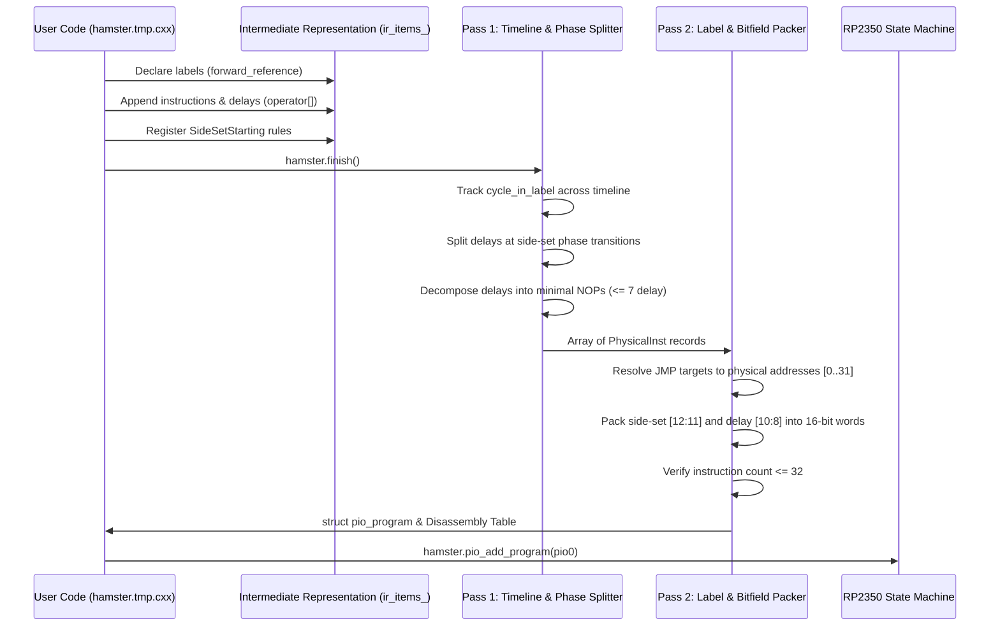

# Runtime PIO Assembler (`PioAssembler`): Architecture, API, and Hamster Bus Engine Guide

## 1. Executive Summary & Motivation

In the TFR/911h (RP2350B + Hitachi 6309E) SBC architecture, the interface between the ARM Cortex-M33 microcontrollers and the 6309E synchronous CPU bus is driven by RP2350 Programmable I/O (PIO) state machines.

Historically, PIO programs were written in assembly files (`.pio`), preprocessed by the Raspberry Pi Pico SDK host tool `pioasm` at compile time, and compiled into static C header files (`.pio.h`). While effective for fixed configurations, this static workflow introduces critical limitations for high-speed hardware:
1. **Clock Frequency Sensitivity**: Bus clock cycle timings ($E$ and $Q$ phase widths, address setup times, data latch hold times) are hardcoded for specific system clocks (e.g. 200MHz vs 250MHz vs 300MHz).
2. **Timing Calibration**: Hand-tuning timing constants requires editing assembly, regenerating headers, and flashing new firmware.
3. **Automated Optimization**: An automated runtime parameter tuning algorithm cannot adjust NOP counts or phase transitions on a running chip.

`PioAssembler` is a header-only runtime C++ assembler class located at [`turbolab/firmware/pio_assembler.h`](file:///home/strick/modoc/coco-shelf/tfr9/v4/turbolab/firmware/pio_assembler.h). It allows PIO programs to be constructed dynamically at firmware startup or dynamically retuned by optimization algorithms.

---

## 2. Core Architectural Philosophy

### Separation of Data Flow from Timing
`PioAssembler` decouples the logical data flow of the bus protocol from the physical clock cycle timings and side-set phase schedules.

- **Logical Protocol**: Instructions (`pull`, `in`, `mov`, `push`, `out`, `jmp`) define *what* happens to data and registers.
- **Tunable Delays (`operator[]`)**: Externally defined parameters ($T_1 \dots T_5$) specify *how long* to wait between operations.
- **Side-Set Phase Schedules (`SideSetStarting`)**: Phase transitions ($K_1 \dots K_4$) specify *when* bus clock lines change relative to program labels.

```mermaid
flowchart TD
    subgraph Logical Protocol
        L1["hamster.pull().block()"]
        L2["hamster.in(A::PINS, 32)"]
        L3["hamster.mov(A::OSR, A::ISR)"]
        L4["hamster.push()"]
    end

    subgraph Tunable Timing
        T1["hamster[T1] (e.g. 16 cyc)"]
        S1["SideSetStarting(LOOP + K1, Phase2)"]
        S2["SideSetStarting(LOOP + K2, Phase3)"]
    end

    Logical Protocol --> TwoPassAssembler["PioAssembler::finish()"]
    Tunable Timing --> TwoPassAssembler

    TwoPassAssembler --> Output["struct pio_program<br/>(28 instructions, auto-NOPs, bit-packed)"]
```

---

## 3. RP2040 / RP2350 PIO Hardware Constraints

Understanding `PioAssembler` requires understanding the underlying hardware constraints of the RP2350 PIO:

1. **Instruction Memory Budget**:
   - Each PIO block contains only **32 instruction words** shared across its four state machines.
   - Hand-written PIO routines quickly exhaust this limit. Efficient NOP decomposition is essential.
2. **16-bit Instruction Word Layout**:
   - Bits `[15:13]`: Opcode (3 bits).
   - Bits `[12:8]`: Delay / Side-set (5 bits total).
   - Bits `[7:0]`: Instruction-specific operands (registers, bit counts, jump conditions, target addresses).
3. **Delay and Side-Set Sharing**:
   - When a state machine configures $S$ side-set bits without the optional enable bit, the side-set bits occupy the MSBs of bits `[12:8]`.
   - The remaining $5 - S$ bits are allocated for instruction delay.
   - For the Hamster bus engine ($S = 2$, controlling $E$ and $Q$), 3 bits remain for delay.
   - **Maximum delay per instruction = $2^3 - 1 = 7$ clock cycles**.
4. **NOP Execution**:
   - The canonical PIO `nop` instruction is encoded as `mov y, y` (`0xa042`).
   - A single NOP instruction consumes 1 cycle to execute, plus up to 7 delay cycles ($1 \dots 8$ cycles total duration per NOP word).

---

## 4. Two-Pass Compilation Architecture

`PioAssembler` uses a two-pass architecture to resolve forward references, decompose delays across phase boundaries, and pack binary opcodes:



### Pass 1: Timeline Scheduling & Phase Splitting
In Pass 1, instructions and delays are converted into physical machine instructions:
- Label definitions bind the label ID to the current physical instruction index and reset `cycle_in_label` to 0.
- When an `IR_DELAY` of $D$ cycles is encountered, `PioAssembler` inspects the active side-set schedule:
  1. It determines the current side-set value at `cycle_in_label`.
  2. It determines the number of cycles remaining before the next side-set change: $\Delta = t_{\text{next}} - \text{cycle}$.
  3. If $D > \Delta$, the delay **must be split across the boundary** so that the side-set value changes at the exact requested clock cycle!
  4. Delays within a phase are emitted as minimal NOPs (`mov y, y`) with `delay = chunk - 1`, where $\text{chunk} \le 1 + \text{max\_delay}$ (i.e. $\le 8$ cycles per NOP).

### Pass 2: Jump Resolution & Bitfield Packing
1. All jump instructions (`JMP`) lookup target label IDs in the symbol table created during Pass 1.
2. If a label was declared but never placed, a fatal error is triggered.
3. The 5-bit target address is packed into instruction bits `[4:0]`.
4. Delay and side-set values are masked, shifted, and packed into bits `[12:8]`.
5. The `pio_program` structure is populated, ready for `pio_add_program()`.

---

## 5. C++ API Reference

### Register Definitions & Enums
Defined under namespace `PioAssembler` (or `using A = PioAssembler;`):

| Constant / Enum | Value | Description |
| :--- | :--- | :--- |
| `A::PINS` | 0 | Pin I/O source/destination |
| `A::X` | 1 | Scratch Register X |
| `A::Y` | 2 | Scratch Register Y |
| `A::ZERO` | 3 | Constant 0 / Null register (`NULL_REG`) |
| `A::PINDIRS` | 4 | Pin direction register |
| `A::EXEC` | 4 | Execute instruction register |
| `A::PC` | 5 | Program Counter |
| `A::STATUS` | 5 | State Machine Status |
| `A::ISR` | 6 | Input Shift Register |
| `A::OSR` | 7 | Output Shift Register |
| `A::INV_ZERO` | `{ZERO, 1}` | Inverted Zero (`~null` / `~zero`) |
| `~A::ZERO` | `{ZERO, 1}` | Overloaded C++ `operator~` for register inversion |

> [!NOTE]
> `A::ZERO` is used instead of `A::NULL` to prevent preprocessor collisions with the C standard library `#define NULL` macro.

### Label Declarations & Forward References
```cpp
// Upfront forward declarations
A::Label BEGIN = hamster.forward_reference("BEGIN");
A::Label RESET = hamster.forward_reference("RESET");
A::Label LOOP  = hamster.forward_reference("LOOP");
A::Label WRITE = hamster.forward_reference("WRITE");
A::Label READ  = hamster.forward_reference("READ");

// Placement
hamster.label(LOOP);

// Jumps
hamster.jmp(RESET);               // Unconditional jump
hamster.jmp(A::Y_DECR, READ);      // Conditional jump (y--)
```

### Side-Set Scheduling Rules
Side-set transitions are specified as offsets from labels:
```cpp
hamster << A::SideSetStarting(LOOP + 0, Phase1);   // At LOOP start: side 0
hamster << A::SideSetStarting(LOOP + 9, Phase2);   // 9 cycles later: side 2
hamster << A::SideSetStarting(LOOP + 19, Phase3);  // 19 cycles later: side 3
```

### Fluent Chaining API (`InstBuilder`)
All instruction builder methods return an `InstBuilder` proxy that supports modifier chaining and implicitly converts back to `PioAssembler&`:

```cpp
hamster.pull().block();            // Block until data available in FIFO
hamster.pull().noblock();          // Non-blocking pull
hamster.push().block();            // Block until FIFO has space
hamster.in(A::PINS, 32);           // Shift 32 bits into ISR
hamster.out(A::ZERO, 31);          // Discard 31 bits from OSR
hamster.mov(A::OSR, A::ISR);       // Copy ISR to OSR
hamster.mov(A::OSR, A::INV_ZERO);  // Set OSR to 0xFFFFFFFF
hamster[16];                       // Insert 16 cycles of delay
```

---

## 6. The Hamster Bus Engine Implementation

[`turbolab/firmware/hamster.tmp.cxx`](file:///home/strick/modoc/coco-shelf/tfr9/v4/turbolab/firmware/hamster.tmp.cxx) implements the complete 6309E synchronous bus engine matching [`hamster.pio`](file:///home/strick/modoc/coco-shelf/tfr9/v4/turbolab/firmware/hamster.pio).

### 6309 Bus Timing & Phase Mapping
The 6309E processor requires two quadrature clock inputs: $E$ (pin 29) and $Q$ (pin 30). The bus cycle divides into 4 distinct phases:

| Phase | Side-Set Value | $Q$ Pin (30) | $E$ Pin (29) | Purpose |
| :--- | :---: | :---: | :---: | :--- |
| **Phase 1** | `0` (0b00) | Low | Low | CPU addresses become valid on bus; Core 1 sync |
| **Phase 2** | `2` (0b10) | High | Low | Addresses stable; PIO latches Address + R/W |
| **Phase 3** | `3` (0b11) | High | High | Data bus setup; Core 1 dispatches Read/Write |
| **Phase 4** | `1` (0b01) | Low | High | Data latched by CPU (Read) or PIO (Write) |

### Cycle Timing Table (at 250 MHz Clock, 3.3 MHz Bus)

```
        |<--- Phase 1 --->|<--- Phase 2 --->|<------- Phase 3 ------->|<------- Phase 4 ------->|
    E:  ____________________________________/-------------------------\_________________________
    Q:  __________________/-------------------------------------------\_________________________
        0                 9                 19                        30/34                     46/47
```

#### Write Cycle (Total = 47 Cycles)
- **Phase 1** ($t = 0 \dots 8$, 9 cycles): `pull block` (1) + `nop [7]` (8). Side-set = `0`.
- **Phase 2** ($t = 9 \dots 18$, 10 cycles): `nop [7]` (8) + `in pins, 32` (1) + `mov osr, isr` (1). Side-set = `2`.
- **Phase 3** ($t = 19 \dots 33$, 15 cycles):
  - Loop header: `push block` (1) + `out null, 31` (1) + `out y, 1` (1) + `jmp y--, Read` (1).
  - Write body: `nop [7]` (8) + `nop [2]` (3). Side-set = `3`.
- **Phase 4** ($t = 34 \dots 46$, 13 cycles): `nop [7]` (8) + `nop [2]` (3) + `in pins, 32` (1) + `push block` (1). Side-set = `1`.
- **Phase 1 Return** ($t = 47$, 1 cycle): `jmp Loop` (1). Side-set = `0`.

#### Read Cycle (Total = 46 Cycles)
- **Phase 1** ($t = 0 \dots 8$, 9 cycles): `pull block` (1) + `nop [7]` (8). Side-set = `0`.
- **Phase 2** ($t = 9 \dots 18$, 10 cycles): `nop [7]` (8) + `in pins, 32` (1) + `mov osr, isr` (1). Side-set = `2`.
- **Phase 3** ($t = 19 \dots 30$, 12 cycles):
  - Loop header: `push block` (1) + `out null, 31` (1) + `out y, 1` (1) + `jmp y--, Read` (1).
  - Read body: `mov osr, ~null` (1) + `out pindirs, 8` (1) + `pull block` (1) + `out pins, 8` (1) + `nop [2]` (3) + `in pins, 32` (1). Side-set = `3`.
- **Phase 4** ($t = 31 \dots 43$, 13 cycles): `push block` (1) + `nop [7]` (8) + `nop [3]` (4). Side-set = `1`.
- **Phase 1 Return / Reset** ($t = 44 \dots 45$, 2 cycles): `mov osr, null` (1) + `out pindirs, 8` (1). Tri-states D[0:7] data pins. Side-set = `0`.

---

## 7. Disassembly Comparison: `hamster.pio` vs. `PioAssembler`

`PioAssembler` generates **28 physical instructions** compared to 29 instructions in the hand-written `hamster.pio.h`, saving 1 instruction word while preserving 100% identical cycle counts and side-set waveforms:

| Addr | `hamster.pio.h` (Golden) | `PioAssembler` Output | Side | Delay | Note |
| :---: | :--- | :--- | :---: | :---: | :--- |
| **00** | `0x001b: jmp 27` | `0x001a: jmp 26` | 0 | 0 | Entry jump to `Reset` |
| **01** | `0x80a0: pull block` | `0x80a0: pull block` | 0 | 0 | `.wrap_target` / `Loop:` |
| **02** | `0xa742: nop [7]` | `0xa742: nop [7]` | 0 | 7 | Phase 1 delay (8 cyc) |
| **03** | `0xb742: nop [7]` | `0xb742: nop [7]` | 2 | 7 | Phase 2 delay (8 cyc) |
| **04** | `0x5000: in pins, 32` | `0x5000: in pins, 32` | 2 | 0 | Latch Address + R/W |
| **05** | `0xb0e6: mov osr, isr` | `0xb0e6: mov osr, isr` | 2 | 0 | Save pins to OSR |
| **06** | `0x9820: push block` | `0x9820: push block` | 3 | 0 | Push address packet |
| **07** | `0x787f: out null, 31` | `0x787f: out null, 31` | 3 | 0 | Discard A[0:15], BS, BA |
| **08** | `0x7841: out y, 1` | `0x7841: out y, 1` | 3 | 0 | Isolate R/W bit into Y |
| **09** | `0x1891: jmp y--, 17` | `0x1891: jmp y--, 17` | 3 | 0 | Jump to `Read:` if R/W=1 |
| **10** | `0xbf42: nop [7]` | `0xbf42: nop [7]` | 3 | 7 | `Write:` Phase 3 (8 cyc) |
| **11** | `0xba42: nop [2]` | `0xba42: nop [2]` | 3 | 2 | Phase 3 (3 cyc) |
| **12** | `0xaa42: nop [2]` | `0xaf42: nop [7]` | 1 | 7 | Phase 4 ($8 + 3 = 11$ cyc) |
| **13** | `0xaf42: nop [7]` | `0xaa42: nop [2]` | 1 | 2 | Phase 4 remainder |
| **14** | `0x4800: in pins, 32` | `0x4800: in pins, 32` | 1 | 0 | Latch written data |
| **15** | `0x8820: push block` | `0x8820: push block` | 1 | 0 | Push write data packet |
| **16** | `0x0001: jmp 1` | `0x0001: jmp 1` | 0 | 0 | Jump to `Loop:` |
| **17** | `0xb8eb: mov osr, ~null` | `0xb8eb: mov osr, ~null` | 3 | 0 | `Read:` Set OSR to 1s |
| **18** | `0x7888: out pindirs, 8` | `0x7888: out pindirs, 8` | 3 | 0 | D[0:7] set to output |
| **19** | `0x98a0: pull block` | `0x98a0: pull block` | 3 | 0 | Fetch read byte from Core 1 |
| **20** | `0x7808: out pins, 8` | `0x7808: out pins, 8` | 3 | 0 | Drive D[0:7] onto bus |
| **21** | `0xba42: nop [2]` | `0xba42: nop [2]` | 3 | 2 | Hold read data setup |
| **22** | `0x5800: in pins, 32` | `0x5800: in pins, 32` | 3 | 0 | Late pin sampling |
| **23** | `0x8820: push block` | `0x8820: push block` | 1 | 0 | Push late pin sample |
| **24** | `0xaa42: nop [2]` | `0xaf42: nop [7]` | 1 | 7 | **OPTIMIZATION**: `PioAssembler` |
| **25** | `0xa842: nop` | `0xab42: nop [3]` | 1 | 3 | merges $3+1+8=12$ cyc |
| **26** | `0xaf42: nop [7]` | `0xa0e3: mov osr, null` | 0 | 0 | into $8+4=12$ cyc (saves 1 inst!) |
| **27** | `0xa0e3: mov osr, null` | `0x6088: out pindirs, 8` | 0 | 0 | `Reset:` D[0:7] set to input |
| **28** | `0x6088: out pindirs, 8` | *(omitted)* | 0 | 0 | `.wrap` |

---

## 8. Paranoid Diagnostics & Error Handling

To safeguard against subtle timing corruption and hardware failures, `PioAssembler` enforces strict safety invariants:

1. **Instruction Memory Overflow**: If the total instruction count exceeds 32 words, compilation halts immediately with a fatal error banner.
2. **Unresolved Labels**: If any jump instruction points to a label ID that was declared but never bound, compilation aborts.
3. **Out-of-Bounds Wrap Points**: Checks that $0 \le \text{wrap\_target} \le \text{wrap} < \text{total\_instructions}$.
4. **Side-Set Value Bounds**: Checks that no side-set value exceeds $(1 \ll \text{sideset\_bits}) - 1$.
5. **Negative Delays**: Rejects negative delay values.
6. **Verbose USB Streaming**: During compilation, `finish()` prints the complete disassembly, phase schedule, and label bindings over `printf`, which streams over USB CDC serial directly to the tether console.

---

## 9. Verification & Test Suite

The test suite in [`turbolab/firmware/test_pio_assembler.cpp`](file:///home/strick/modoc/coco-shelf/tfr9/v4/turbolab/firmware/test_pio_assembler.cpp) verifies the assembler on the host before flashing to hardware:

```bash
# Build and run host test suite
g++ -std=c++17 -Wall -Wextra -Werror -I. test_pio_assembler.cpp -o test_pio_assembler
./test_pio_assembler
```

Test results:
- **Test 1**: Assembles `hamster.tmp.cxx`, confirms 28 instructions generated, validates `.wrap_target` and `.wrap`.
- **Test 2**: Simulates edge-case failure modes (overflow > 32 instructions, unresolved labels, negative delays, duplicate label bindings) and verifies that every paranoid check triggers and aborts cleanly.
