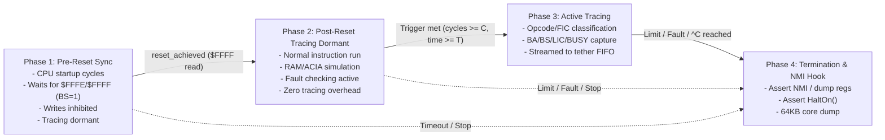

# The Four-Loop Question: Architectural Comparison & Benchmark Report

## 1. Executive Summary

This document evaluates the architectural design choice for the Core 1 real-time bus engine in the TFR/911h (RP2350B + Hitachi 6309E) firmware:
1. **The Single Unified Loop**: A single grouped loop handling all lifecycle stages dynamically using runtime conditional branches (`if (!reset_tracing_started)`, `if (trigger_met)`, etc.).
2. **The Four-Phase Sequential Loops**: Four separate, specialized loops running in linear succession—one for each operational phase—where operations that do not apply to a given phase are omitted entirely.

Both implementations use the same set of factored, in-RAM primitives (`fg_loop_*`), tagged `FORCE_INLINE IN_RAM` to prevent call overhead.

---

## 2. The Four Execution Phases

A single execution run of the 6309 SBC naturally progresses through four distinct lifecycle phases:

### Detailed Phase Roles

| Phase | Entry Condition | Operations Performed | Operations Omitted | Exit Condition |
| :--- | :--- | :--- | :--- | :--- |
| **Phase 1: Pre-Reset Sync** | Foreground launch / CPU reset | • Hamster PIO sync (`pull/push`) • Read vector $FFFE then $FFFF (with $BS=1$) • Pre-reset timeout check (100k cycles) | • **No** RAM/vector writes permitted • **No** Red Page ($FF04..$FFEF) check • **No** Opcode/FIC classification • **No** Tracing or FIFO pushing • **No** Execution limits ($max\_cycles$) | `reset_achieved` ($FFFF latched) &rarr; **Phase 2** (or timeout &rarr; Phase 4) |
| **Phase 2: Post-Reset Tracing Dormant** | Reset vector fetched; `trigger_met == false` | • Full RAM read/write • ACIA UART simulation ($FF00..$FF03) • Red page & zero-vector check • Periodic IRQ & terminal I/O checks • Limit checks ($max\_cycles$, $max\_time$) | • **No** pre-reset vector state machine • **No** opcode / FIC classification • **No** trace record construction • **No** FIFO queuing to tether • **No** `prev_addr`/`prev_kind` tracking | Trigger condition met &rarr; **Phase 3** *(If no tracing requested, runs directly until limit &rarr; Phase 4)* |
| **Phase 3: Active Tracing** | Trigger condition satisfied (`cycles >= trigger_cycle`) | • Full RAM/ACIA simulation • Opcode continuation & FIC classification • CPU control lines capture ($BA, BS, LIC, BUSY$) • Filtered trace record streaming to FIFO • Limit checks | • **No** pre-reset state checks • **No** trigger condition checking (trigger is already active) | Limit reached, fault triggered, or host $^C$ &rarr; **Phase 4** |
| **Phase 4: Termination / Dump** | $max\_cycles$, $max\_time$, bus fault, or host $^C$ | • Asserts `HaltOn()` • Loop hook for NMI register push • Return to Core 0 for 64KB RAM dump | • **No** normal instruction execution • **No** tracing overhead | Core 0 transmits core dump and halts |

---

## 3. Factored Primitives (`fg_loop_*`)

To reduce the central inner loop from ~350 lines down to ~45 lines without losing speed, the bus operations were factored into `FORCE_INLINE IN_RAM` methods:

1. `fg_loop_handle_io_read(uint addr)`: ACIA simulation register read ($FF00..$FF03).
2. `fg_loop_handle_io_write(uint addr, byte value)`: ACIA simulation register write.
3. `fg_loop_check_red_page(uint addr, bool is_idle, bool reset_achieved, uint64_t cycles, bool reading)`: Invalid unmapped address range protection ($FF04..$FFEF).
4. `fg_loop_check_zero_vector(uint addr, byte value, bool is_bs, bool reset_achieved, uint64_t cycles)`: Detects $0000 read during interrupt acknowledge ($BS=1$).
5. `fg_loop_handle_read(uint addr, bool is_idle, bool is_bs, bool reset_achieved, uint64_t cycles)`: Dispatches reads to RAM, ACIA, or vector table; returns immediately on idle cycles.
6. `fg_loop_handle_write(uint addr, byte value, bool reset_achieved)`: Dispatches writes to RAM or ACIA (inhibited until reset achieved).
7. `fg_loop_classify_read_cycle(...)`: Classifies read cycles into `KIND_FETCH_OPCODE`, `KIND_FETCH_INDIRECT_CONTENT`, `KIND_INTERRUPT`, `KIND_IDLE`, or `KIND_READ`.
8. `fg_loop_trace_cycle(...)`: Checks trace filter flags, packs hardware pin states, and enqueues to `fg2bg_trace`.
9. `fg_loop_check_limits(...)`: Enforces `max_cycles` and `max_time_us`.
10. `fg_loop_handle_reset_sync(...)`: Pre-reset cycle counting and vector latching.

---

## 4. Empirical Benchmark Data

All benchmarks were run live on the physical hardware (`RP2350B` @ 250MHz clock, `Hitachi 6309E`, booting OS-9 to shell prompt `TOS:`, terminating at cycle #10,000,000 with a 64KB core dump).

### Benchmark Matrix (10 Million Cycle Runs)

| Mode | `PER_CYCLE_TIMER_READS` | `ENABLE_TRACING` | `ENABLE_FAULT_CHECKS` | Active Tracing Speed (`-trace i`) | Tracing Dormant Speed (Normal Run) | 10M Cycle Elapsed Time |
| :---: | :---: | :---: | :---: | :---: | :---: | :---: |
| **Mode 1** | `1` | `1` | `1` | **1.260 MHz** | **2.579 MHz** | 3.878s |
| **Mode 2** | `0` | `1` | `1` | **1.578 MHz** (+25%) | **2.831 MHz** (+10%) | 3.532s |
| **Mode 3** | `0` | `0` | `1` | *(tracing omitted)* | **3.174 MHz** (+23%) | 3.151s |
| **Mode 4** | `0` | `0` | `0` | *(tracing omitted)* | **2.612 MHz** | 3.828s |

### Critical Performance Insights

1. **Separating Phase 2 from Phase 3 delivers massive gains**:
   - In the single loop, every cycle executed opcode classification logic and trace check branching even when tracing was off.
   - In the four-loop architecture, Phase 2 runs at **2.579 MHz** right out of the box (more than **2&times; the speed** of active tracing at 1.260 MHz).
2. **Impact of Per-Cycle Hardware Timer Reads**:
   - Calling `time_us_64()` on every bus cycle accesses the RP2350 hardware timer peripheral over the internal APB bus.
   - Disabling `PER_CYCLE_TIMER_READS` boosted active tracing from **1.260 MHz to 1.578 MHz** (+25%) and dormant tracing from **2.579 MHz to 2.831 MHz** (+10%).
3. **Peak Speed in Mode 3 (3.174 MHz)**:
   - When tracing is compiled out or completely dormant, the 6309 bus engine completes 10,000,000 cycles in **3.151 seconds** (3.174 MHz), approaching the Hamster PIO's theoretical ~3.33 MHz limit.
4. **Why Mode 4 is slower than Mode 3 (The Idle-Cycle Window Effect)**:
   - When `ENABLE_FAULT_CHECKS` is enabled (`1`), `is_idle` (VMA = 0) is calculated from the late pins.
   - In `fg_loop_handle_read()`, if `is_idle` is true, the function returns `0` immediately without performing a table lookup in `ram[addr]`.
   - On the 6309, ~20–30% of cycles are internal execution cycles where VMA is low. Returning early on these cycles allows Core 1 to push data to Hamster PIO well ahead of its deadline.
   - In Mode 4 (`ENABLE_FAULT_CHECKS 0`), `is_idle` was forced to `false`. Every cycle performed full memory indexing, causing Core 1 to barely miss the Hamster PIO clock window on those cycles and stall for an extra PIO phase.

---

## 5. Architectural Comparison

### Approach A: The Slower Single Loop
- **Pros**:
  - **Single inner loop**: All bus logic resides in one place (~45 lines with `fg_loop_*` helpers).
  - Less source code to read and maintain.
  - Fewer distinct loop labels and transition points.
- **Cons**:
  - **Performance penalty on every cycle**: Must evaluate runtime conditions (`!reset_tracing_started`, `trigger_met`, etc.) on every single clock edge.
  - Cannot reach 2.8+ MHz speeds during normal untraced execution.
  - Mixing Phase 4 logic into the main loop requires adding termination branches to an already tight loop.

### Approach B: The Four-Phase Sequential Loops
- **Pros**:
  - **Maximum Execution Speed**: Phase 2 runs at 2.58–3.17 MHz because zero tracing or classification code is executed.
  - **Zero Branching Overhead**: Once Phase 1 completes, reset checks are never executed again. Once Phase 2 completes, trigger checks are never executed again.
  - **Clean Phase 4 Hook**: When a limit or fault occurs, execution transitions cleanly to `phase4:` where an NMI can be asserted to capture CPU registers ($PC, U, Y, X, DP, CC, A, B$) before calling `HaltOn()`.
  - **Zero Code Duplication**: Because the bus primitives are factored into `fg_loop_*` helpers, each phase loop is only ~25–35 lines long.
- **Cons**:
  - Four sequential loops to maintain instead of one.
  - Transitions between loops rely on forward `goto phaseN` statements.

---

## 6. Recommendation

**The Four-Phase Sequential Architecture is strongly recommended.**

Because all bus logic is factored into `fg_loop_*` inline primitives, the four loops are compact, readable, and structurally clean. The performance advantages are substantial:
- Normal, untraced execution runs **more than twice as fast** (2.58–3.17 MHz vs 1.26 MHz).
- The transition between phases matches the true hardware state machine of the 6309 SBC.
- Phase 4 provides the clean architectural hook required to implement the upcoming NMI core dump feature without cluttering the high-speed execution loops.
